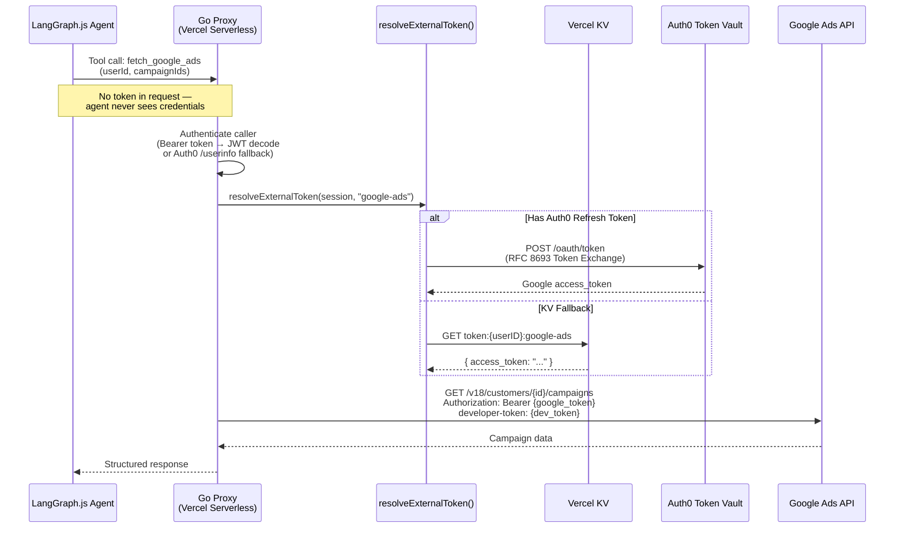
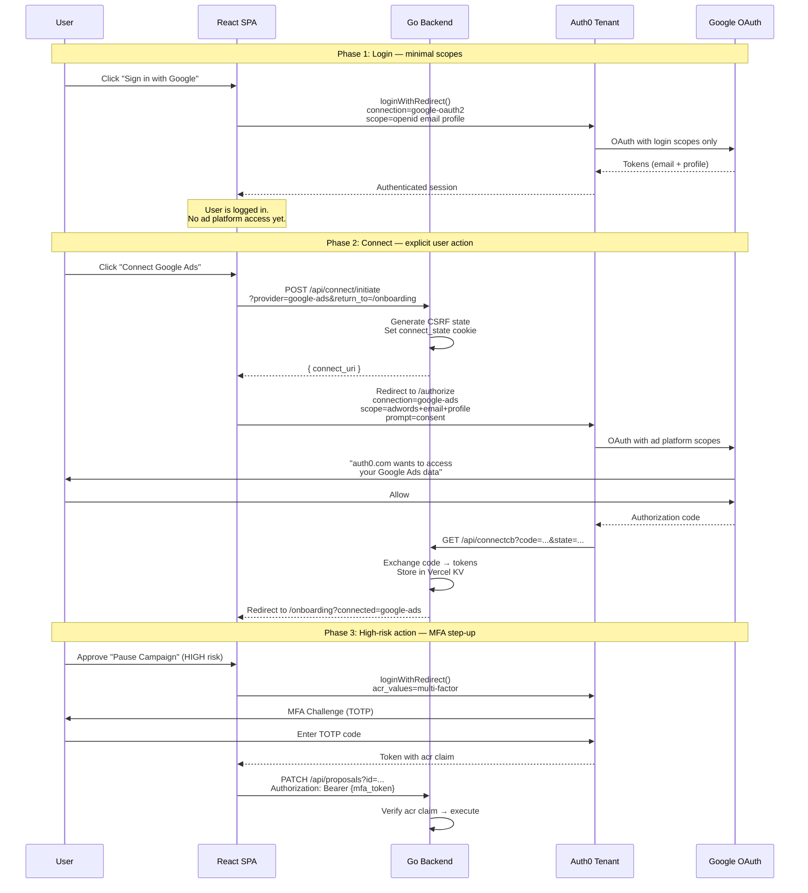
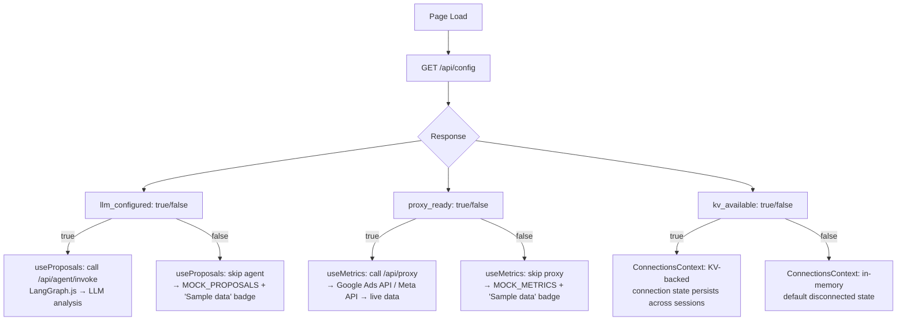
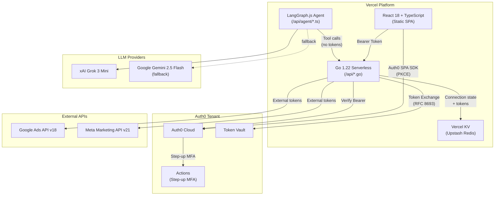

# Building Secure AI Agents with Auth0: Three Patterns from Production

*How we built AdBrain — an AI ad campaign optimizer — with token isolation, progressive consent, and environment-aware data routing.*

---

## Introduction

When you give an AI agent access to external APIs, the hardest problem isn't *what it can do* — it's *what you allow it to do*.

Modern AI agents need OAuth2 tokens to call services like Google Ads or Meta Marketing API on behalf of users. But handing raw tokens to an LLM-powered agent creates serious risks: prompt injection could exfiltrate tokens, overly broad scopes invite abuse, and silent failures in token refresh leave users stranded without feedback.

We built **AdBrain**, an AI-powered ad campaign optimizer that uses [LangGraph.js](https://langchain-ai.github.io/langgraphjs/) agents to analyze Google Ads and Meta campaigns, generate optimization proposals, and execute approved changes — all while keeping external tokens completely isolated from the agent runtime.

This article shares **three architectural patterns** we developed during the build. Each pattern is reusable for any system where an AI agent needs to call OAuth2-protected APIs.

**Tech stack**: React 18 + TypeScript (SPA), Go 1.22 (Vercel Serverless), LangGraph.js + xAI Grok, Auth0 (OAuth broker + MFA), Vercel KV (Upstash Redis).

> Source: [github.com/ryohei-emori/adbrain](https://github.com/ryohei-emori/adbrain)

---

## Pattern 1: Agent-Proxy-Vault — Token Isolation by Architecture

### The Problem

If you pass an OAuth access token directly to an LLM agent (e.g., as a tool parameter or in the system prompt), you lose control over how that token is used. A sufficiently creative prompt injection could cause the agent to leak the token in its output, or use it for unintended API calls.

### The Pattern

Separate token management from agent logic entirely. The agent specifies *what data it needs*; a backend proxy resolves *how to authenticate*:



The key insight: **three trust boundaries** exist between the user's browser and the external API. The agent operates within the middle boundary and never crosses into the token boundary:

```
Browser (Auth0 SPA SDK)  →  Go Proxy (token resolution)  →  External API
         ↑                          ↑                           ↑
    User identity             Token isolation              Scoped access
```

### Implementation

The Go proxy resolves external tokens with a two-strategy fallback:

```go
func resolveExternalToken(session *auth.Session, provider string) (string, time.Duration, error) {
    // Strategy 1: Auth0 Token Vault (RFC 8693 Token Exchange)
    if session.RefreshToken != "" {
        token, dur, err := auth.ExchangeToken(session.RefreshToken, provider)
        if err == nil {
            return token, dur, nil
        }
    }
    // Strategy 2: KV lookup (stored during OAuth connect callback)
    kvClient, err := kv.New()
    if err != nil {
        return "", 0, fmt.Errorf("no refresh token and KV unavailable: %w", err)
    }
    raw, _ := kvClient.Get("token:" + session.UserID + ":" + provider)
    var stored struct{ AccessToken string `json:"access_token"` }
    json.Unmarshal([]byte(raw), &stored)
    return stored.AccessToken, time.Since(start), nil
}
```

The Auth0 Token Exchange follows [RFC 8693](https://datatracker.ietf.org/doc/html/rfc8693):

```go
params := url.Values{
    "grant_type":           {"urn:auth0:params:oauth:grant-type:token-exchange:federated-connection-access-token"},
    "subject_token":        {refreshToken},
    "subject_token_type":   {"urn:ietf:params:oauth:token-type:refresh_token"},
    "requested_token_type": {"urn:auth0:params:oauth:token-type:external-provider-token"},
    "client_id":            {os.Getenv("AUTH0_CLIENT_ID")},
    "client_secret":        {os.Getenv("AUTH0_CLIENT_SECRET")},
    "connection":           {connection},
}
resp, _ := http.PostForm("https://"+domain+"/oauth/token", params)
```

This pattern applies to **any OAuth2-protected API** — not just advertising platforms. If your agent calls GitHub, Slack, Salesforce, or any service that issues OAuth tokens, the same proxy-vault architecture keeps tokens out of the agent's reach.

---

## Pattern 2: Progressive Consent with Auth0 as OAuth Broker

### The Problem

Requesting all permissions at first login causes user drop-off. Asking for `adwords` scope during Google Sign-In is confusing — the user just wants to log in, not grant campaign management access yet. But you also can't skip permissions entirely, because the agent needs them to function.

### The Pattern

Separate **authentication** (who you are) from **authorization** (what the agent can access). Use Auth0 as an OAuth broker to add scopes incrementally:



The Auth0 tenant manages two distinct connection types:

| Connection | Purpose | Scopes | When Triggered |
|---|---|---|---|
| `google-oauth2` | Authentication (login) | `openid email profile` | First visit |
| `google-ads` | Connected Accounts (API access) | `adwords email profile` | User clicks "Connect" |

This separation is configured in Terraform:

```hcl
resource "auth0_connection" "google_oauth2" {
  name     = "google-oauth2"
  strategy = "google-oauth2"
  # Used for login only — minimal scopes
}

resource "auth0_connection" "google_ads" {
  name     = "google-ads"
  strategy = "oauth2"
  options {
    client_id     = var.google_ads_client_id
    client_secret = var.google_ads_client_secret
    authorization_endpoint = "https://accounts.google.com/o/oauth2/v2/auth?access_type=offline&prompt=consent"
    token_endpoint         = "https://oauth2.googleapis.com/token"
    scopes                 = ["https://www.googleapis.com/auth/adwords", "openid", "email", "profile"]
  }
  # Used for Connected Accounts — ad platform scopes
}
```

For Step-up Auth, an Auth0 Post Login Action conditionally triggers MFA:

```javascript
exports.onExecutePostLogin = async (event, api) => {
  const requestedACR = event.request.query?.acr_values;
  if (requestedACR?.includes(
    "http://schemas.openid.net/pape/policies/2007/06/multi-factor"
  )) {
    if (event.authentication?.methods?.find(m => m.name === "mfa")) {
      api.idToken.setCustomClaim("acr",
        "http://schemas.openid.net/pape/policies/2007/06/multi-factor");
    } else {
      api.authentication.challengeWithAny([
        { type: "otp" },
        { type: "push-notification" }
      ]);
    }
  }
};
```

---

## Pattern 3: Environment-Aware Data Source Routing

### The Problem

Real-world agent deployments don't flip from "mock" to "live" overnight. During development, you might have Auth0 configured but no LLM API keys. In staging, you might have LLM keys but no Google Ads Developer Token. You need the system to gracefully degrade based on what's actually available — without manual feature flags.

### The Pattern

Add a capabilities endpoint that inspects environment variables and lets the frontend route data fetching accordingly:



The backend config endpoint is straightforward:

```go
func Handler(w http.ResponseWriter, r *http.Request) {
    caps := Capabilities{
        LLMConfigured:  os.Getenv("XAI_API_KEY") != "" || os.Getenv("GOOGLE_AI_API_KEY") != "",
        ProxyReady:     os.Getenv("GOOGLE_ADS_DEVELOPER_TOKEN") != "",
        KVAvailable:    os.Getenv("KV_REST_API_URL") != "" && os.Getenv("KV_REST_API_TOKEN") != "",
    }
    w.Header().Set("Cache-Control", "public, max-age=300")
    json.NewEncoder(w).Encode(caps)
}
```

The frontend uses a shared `useAuthFetch` hook that attaches Auth0 Bearer tokens to every API call, ensuring a **unified communication method** regardless of whether the response will be live or mock:

```typescript
// useAuthFetch.ts — all API calls go through this
export function useAuthFetch() {
  const { getAccessTokenSilently } = useAuth();
  const getTokenRef = useRef(getAccessTokenSilently);
  getTokenRef.current = getAccessTokenSilently;

  return useCallback(async (url: string, init?: RequestInit) => {
    const headers = new Headers(init?.headers);
    try {
      const token = await getTokenRef.current();
      if (token) headers.set("Authorization", `Bearer ${token}`);
    } catch { /* falls back to cookie auth */ }
    return fetch(url, { ...init, headers, credentials: "include" });
  }, []);
}
```

Data hooks then check capabilities before making calls:

```typescript
// useProposals.ts — conditional agent invocation
const refresh = useCallback(async () => {
  // 1. Check KV for previously stored proposals
  const kvProposals = await fetchFromGoAPI();
  if (kvProposals) { setSource("kv"); return; }

  // 2. Only call agent if LLM is configured
  if (config.llmConfigured) {
    const agentProposals = await fetchFromAgent();
    if (agentProposals) { setSource("agent"); return; }
  }

  // 3. Fallback to mock data
  setProposals(MOCK_PROPOSALS);
  setSource("mock");
}, [config.llmConfigured]);
```

This pattern gives you **zero-config progressive deployment**: add an LLM API key to Vercel environment variables, redeploy, and the UI automatically switches from "Sample data" to "AI Agent" — no code changes required.

---

## Lessons Learned

Building AdBrain surfaced several practical challenges worth sharing with the Auth0 community:

**1. SPA + OAuth Redirect = Session Loss.** Auth0's SPA SDK stores tokens in memory by default. During the OAuth connect flow (browser navigates away to Google, then back via `/api/connectcb`), the in-memory session is lost. We solved this with `cacheLocation: "localstorage"` and a `ProtectedRoute` component that detects `?connected=` query parameters and triggers `loginWithRedirect()` to re-establish the session.

**2. Cookie parsing across redirects is fragile.** Our `connect_state` cookie (used for CSRF protection and preserving `return_to`) originally used pipe-delimited values. Auth0 user IDs contain pipe characters (`auth0|abc123`), breaking the parser. Switching to JSON-encoded, URL-escaped cookie values fixed this.

**3. Token Exchange requires careful fallback design.** The ideal flow uses Auth0 Token Vault's RFC 8693 token exchange. But in development (free tier, SPA architecture without server-side refresh tokens), we needed a KV-based fallback where the connect callback stores the Google access token directly. The `resolveExternalToken()` function tries Token Vault first, then KV — making the same code work in both environments.

**4. Service Workers cache OAuth redirects.** If you're using a PWA service worker (e.g., `vite-plugin-pwa`), it can cache the JavaScript bundle from *before* your OAuth fix deployment. Users get stuck in a redirect loop with stale code. We disabled the PWA plugin entirely and added a self-unregistering service worker at `/sw.js` to clean up existing installations.

**5. Environment variable detection beats feature flags.** Rather than maintaining separate feature flag configurations for dev/staging/prod, we let the backend introspect its own environment (`/api/config`). This eliminated an entire class of "works on my machine" bugs where someone forgot to toggle a flag.

---

## System Architecture Overview

For reference, here is the complete architecture as deployed:



---

## Conclusion

The three patterns — **Agent-Proxy-Vault** for token isolation, **Progressive Consent** for incremental authorization, and **Environment-Aware Routing** for graceful degradation — are not specific to advertising platforms. They apply to any system where an AI agent needs to call OAuth2-protected APIs on behalf of users.

Auth0 provides the critical infrastructure for this: Token Vault isolates external credentials, Connections separate authentication from API authorization, and Actions enable conditional MFA challenges — all manageable through Terraform for reproducible deployments.

If you're building an AI agent that needs to call external APIs, consider these questions:
1. Can your agent see the raw OAuth tokens? If yes, you need Pattern 1.
2. Are you requesting all scopes at login? If yes, you need Pattern 2.
3. Do you have different environments with different capabilities? If yes, you need Pattern 3.

The full source code is available at [github.com/ryohei-emori/adbrain](https://github.com/ryohei-emori/adbrain).

---

## References

- [Auth0 Token Vault Documentation](https://auth0.com/features/token-vault)
- [RFC 8693: OAuth 2.0 Token Exchange](https://datatracker.ietf.org/doc/html/rfc8693)
- [Auth0 Actions Documentation](https://auth0.com/docs/customize/actions)
- [Auth0 Terraform Provider](https://registry.terraform.io/providers/auth0/auth0/latest/docs)
- [LangGraph.js Documentation](https://langchain-ai.github.io/langgraphjs/)
- [Auth0 Log Streams](https://auth0.com/docs/customize/log-streams)
- [OWASP: Prompt Injection](https://owasp.org/www-project-top-10-for-large-language-model-applications/)
- [Vercel Serverless Functions (Go)](https://vercel.com/docs/functions/runtimes/go)
