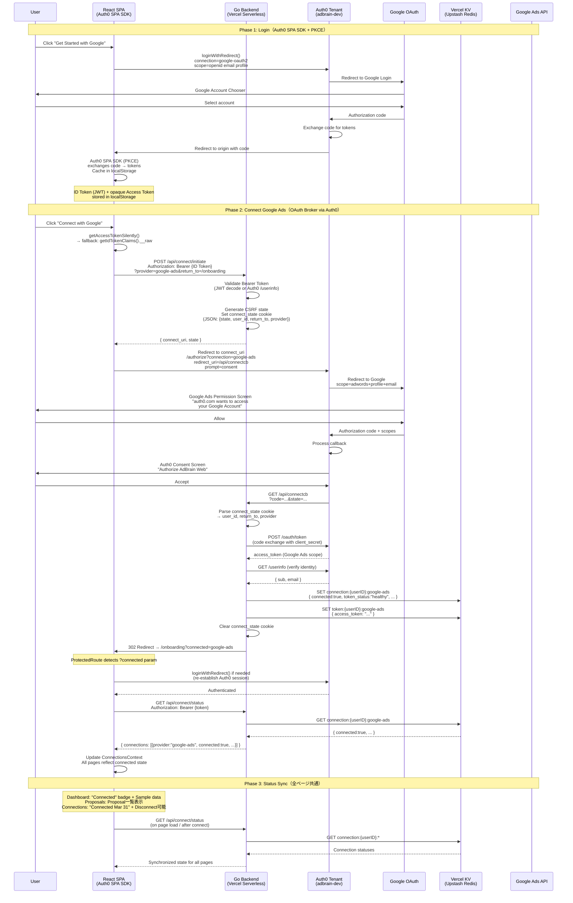

# AdBrain – AI Ad Campaign Optimizer
 AdBrain – システム設計書
> 対応要件: [docs/requirements.md](./requirements.md)
> ハッカソン: [Authorized to Act: Auth0 for AI Agents](https://authorizedtoact.devpost.com/)
> 締切: 2026-04-06 23:45 PDT
---
## 1. アーキテクチャ概要
```
┌─────────────────────────────────────────────────────────────────┐
│                         Vercel Platform                         │
│                                                                 │
│  ┌──────────────┐    ┌──────────────────┐    ┌───────────────┐  │
│  │  React/TS    │───▶│  Go Serverless   │───▶│ LangGraph.js  │  │
│  │  Frontend    │◀───│  API Gateway     │◀───│ Agent         │  │
│  │  (Static)    │    │  (/api/*.go)     │    │ (Serverless)  │  │
│  └──────┬───────┘    └───────┬──────────┘    └───────┬───────┘  │
│         │                    │                       │          │
└─────────│────────────────────│───────────────────────│──────────┘
          │                    │                       │
          │            ┌───────▼──────────┐    ┌───────▼───────┐
          │            │   Auth0 Tenant   │    │   xAI Grok    │
          │            │  ┌─────────────┐ │    │   API (LLM)   │
          └───────────▶│  │ Token Vault │ │    └───────────────┘
           Auth0 SDK   │  └──────┬──────┘ │
                       │         │        │
                       └─────────│────────┘
                                 │
                    ┌────────────┼────────────┐
                    ▼                         ▼
           ┌───────────────┐        ┌─────────────────┐
           │ Google Ads API│        │ Meta Marketing   │
           │ (REST)        │        │ API (Graph API)  │
           └───────────────┘        └─────────────────┘
```
### デプロイ構成
| レイヤー | テクノロジー | デプロイ先 | 理由 |
|---|---|---|---|
| フロントエンド | React 18 + TypeScript + Vite | Vercel Static | CDN配信、ゼロコンフィグ |
| APIゲートウェイ | Go 1.22 | Vercel Serverless Functions (`/api/*.go`) | Auth0 SDK 公式サポート、型安全 |
| AIエージェント | LangGraph.js + xAI Grok | Vercel Serverless Functions (`/api/agent/*.ts`) | ステートレスrun、Edge Runtime対応 |
| 認証基盤 | Auth0 Free Tier | Auth0 Cloud | Token Vault、MFA Actions、Management API |
| 外部API | Google Ads REST API v18 / Meta Graph API v21 | 各社クラウド | Token Vault経由でアクセス |
---
## 2. Auth0 統合設計
### 2.1 認証戦略: Progressive Consent

広告運用ユーザーは高確率で Google アカウント保有者（Google Ads を運用するため）。
ログインと API 権限付与を **段階的同意（Progressive Consent）** で分離する。

| フェーズ | 操作 | スコープ | Auth0 メカニズム |
|---|---|---|---|
| **ログイン** | Google でサインイン | `email`, `profile`, `openid` | Google Social Connection (purpose: Authentication) |
| **接続: Google Ads** | 「Google Adsを接続」ボタン | `https://www.googleapis.com/auth/adwords` | Connected Accounts → Token Vault |
| **接続: Meta Ads** | 「Meta Adsを接続」ボタン | `ads_management`, `ads_read` | Connected Accounts → Token Vault |
| **Step-up** | 高リスク操作の承認 | MFA チャレンジ | Auth0 Actions + `acr_values` |

**なぜ Progressive Consent か:**
- ログイン時は最小権限（email/profile のみ）→ Security Model の「最小権限」を体現
- 広告API権限は明示的なユーザー操作で付与 → User Control の「同意の可視化」を体現
- ログインと API 権限が分離 → トークン漏洩時の被害範囲を限定

**Enterprise SSO 拡張 (将来):**
Auth0 有料プランでは Google Workspace Enterprise Connection / Okta Workforce Identity Federation も利用可能。
企業顧客が自社 IdP ポリシー（パスワードポリシー、条件付きアクセス等）を強制できる。
Free Tier MVP では Google Social + Email/Password フォールバックで十分。

### 2.2 テナント構成

```
Auth0 Tenant: adbrain-dev
├── Applications
│   ├── AdBrain Web (Regular Web Application)
│   │   ├── type: confidential
│   │   ├── grant_types: [authorization_code, refresh_token, urn:auth0:params:oauth:grant-type:token-exchange]
│   │   └── oidc_conformant: true
│   └── AdBrain M2M (Machine to Machine)
│       └── Auth0 Management API 用
│
├── Connections (Authentication)
│   ├── google-oauth2 (Google Social)
│   │   ├── scope: email, profile, openid
│   │   ├── purpose: authentication           ← ログイン専用
│   │   └── ※ 広告API権限はここでは要求しない
│   │
│   └── Username-Password-Authentication (フォールバック)
│       └── ※ Google アカウントを持たないユーザー向け
│
├── Connections (Connected Accounts for Token Vault)
│   ├── google-ads (Custom OAuth2)
│   │   ├── authorization_url: https://accounts.google.com/o/oauth2/v2/auth
│   │   ├── token_url: https://oauth2.googleapis.com/token
│   │   ├── scope: https://www.googleapis.com/auth/adwords
│   │   └── purpose: connected_accounts       ← Token Vault 専用
│   │
│   └── meta-ads (Custom OAuth2)
│       ├── authorization_url: https://www.facebook.com/v21.0/dialog/oauth
│       ├── token_url: https://graph.facebook.com/v21.0/oauth/access_token
│       ├── scope: ads_management,ads_read
│       └── purpose: connected_accounts       ← Token Vault 専用
│
├── Actions
│   └── Login Flow
│       └── step-up-mfa (Post Login Action)
│           └── acr_values に基づきMFAを要求
│
└── MFA
    ├── Factor: OTP (TOTP)
    └── Policy: Never (Actions で制御)
```
### 2.3 認証フロー（Google Social Login via Auth0 SPA SDK）

```
[ユーザー] ──(1)──▶ [React SPA] "Googleでログイン"
                       │
              (2) Auth0 SPA SDK loginWithRedirect()
                  → Auth0 Universal Login
                  connection=google-oauth2
                  scope=openid email profile
                       │
                       ▼
              [Google OAuth Consent]
                  "AdBrain がメールアドレスとプロフィールへの
                   アクセスを求めています"
                  ※ 広告 API 権限はここでは要求しない
                       │
              (3) 同意 → Auth0 callback → code
                       │
                       ▼
              [Auth0 SPA SDK (PKCE)]
                  Auth0 が code を token に交換（サーバーレス）
                       │
              (4) ID Token (JWT) + opaque Access Token
                  → localStorage にキャッシュ（cacheLocation: "localstorage"）
                  ID Token claims: { sub, email, name, picture }
                       │
                       ▼
              [React SPA]
                  ├── onRedirectCallback で遷移先を決定
                  ├── Auth0Provider が認証状態を管理
                  └── 初回ログイン → /onboarding へナビゲート
                       │
                       ▼
              [Go Backend] への API 呼出時:
                  getAccessTokenSilently() or getIdTokenClaims().__raw
                  → Authorization: Bearer <token> ヘッダーで送信
                  → Go Backend は /userinfo or JWT decode で検証
```
### 2.4 接続フロー（Connect via Auth0 OAuth Broker）
```
[ユーザー] ──(1)──▶ [React SPA] "Connect with Google"ボタン
                       │
              (2) POST /api/connect/initiate?provider=google-ads&return_to=/onboarding
                  Authorization: Bearer <ID Token (JWT)>
                       │
                       ▼
              [Go Backend]
                  ├── Bearer Token を検証（JWT decode or /userinfo）
                  ├── CSRF state 生成（connect:google-ads:<nonce>）
                  ├── connect_state cookie 設定（JSON: {state, user_id, return_to, provider}）
                  └── Auth0 /authorize URL を返却
                       │
              (3) connect_uri を受信 → window.location.href でリダイレクト
                       │
                       ▼
              [Auth0 /authorize]
                  connection=google-ads, scope=openid email profile offline_access
                  redirect_uri={BASE_URL}/api/connectcb, prompt=consent
                       │
                       ▼
              [Google OAuth Consent Screen]
                  scope: adwords + profile + email
                       │
              (4) 同意 → Auth0 /login/callback → Auth0 がトークン処理
                       │
                       ▼
              [Auth0] → /api/connectcb?code=...&state=... へリダイレクト
                       │
                       ▼
              [Go /api/connectcb]
                  ├── connect_state cookie からuser_id, return_to, provider を取得
                  ├── Auth0 /oauth/token でcode→token交換（client_secret使用）
                  ├── Vercel KV に接続状態を保存: connection:{userID}:{provider}
                  ├── Vercel KV にトークンを保存: token:{userID}:{provider}
                  ├── connect_state cookie を削除
                  └── {return_to}?connected=google-ads へリダイレクト
                       │
              (5) ProtectedRoute が connected param を検知
                  → 未認証なら loginWithRedirect（Auth0 セッション再確立）
                  → 認証済みなら ConnectionsProvider.refresh() でKVから最新状態取得
                       │
                       ▼
              [React SPA] ── 接続済み状態で元のページを表示
```
### 2.5 Token Exchange フロー（エージェント/フロントエンドがAPIを呼ぶとき）

**統一通信方式**: フロントエンドの全 API 呼び出しは `useAuthFetch` フック経由で Auth0 Bearer Token を付与する。バックエンドは `resolveExternalToken()` で外部トークンを解決する（KV → Token Vault フォールバック）。

```
[React SPA]
    │
    │ (1) useAuthFetch() → Authorization: Bearer <Auth0 token>
    │     GET /api/proxy?action=google-ads&path=/customers
    │
    ▼
[Go Proxy: resolveExternalToken()]
    │
    │ (2a) session.RefreshToken あり → Auth0 Token Vault Exchange
    │      ↓ 失敗時
    │ (2b) Vercel KV: GET token:{userID}:google-ads
    │      → { access_token: "<google_token>" }
    │
    ▼
[Go Proxy]
    │
    │ (3) Authorization: Bearer <google_access_token>
    │     developer-token: <GOOGLE_ADS_DEVELOPER_TOKEN>
    │     GET https://googleads.googleapis.com/v18/customers/{id}/campaigns
    │
    ▼
[Google Ads API] → レスポンスを SPA / LangGraph.js に返却
```

**フロントエンド通信フック階層**:
```
useAuthFetch()           ← 共通: Bearer Token 付与
  ├── ConnectionsContext ← 接続状態管理 (connect, status, disconnect)
  ├── useMetrics()       ← /api/proxy → Dashboard メトリクス
  └── useProposals()     ← /api/proposals, /api/agent/invoke → Proposals

useSystemConfig()        ← /api/config → バックエンド環境判定 (キャッシュ付き)
  → llm_configured       : XAI_API_KEY or GOOGLE_AI_API_KEY が設定済み
  → proxy_ready          : Developer Token or Meta App Secret が設定済み
  → google_developer_token, meta_configured, kv_available
```

**データソース分岐ロジック**:
```
┌─────────────────────────────────────────────────────────┐
│  useMetrics (Dashboard メトリクス)                        │
│                                                         │
│  config.proxyReady?                                     │
│    ├─ YES → authFetch(/api/proxy) → resolveExternalToken│
│    │        → Google Ads API / Meta API → LIVE data     │
│    └─ NO  → MOCK_METRICS (Sample data バッジ)            │
└─────────────────────────────────────────────────────────┘

┌─────────────────────────────────────────────────────────┐
│  useProposals (最適化提案)                                │
│                                                         │
│  1. /api/proposals (KV 保存済み) → 存在すれば "kv"        │
│  2. config.llmConfigured?                               │
│     ├─ YES → /api/agent/invoke → LangGraph.js Agent     │
│     │        → LLM 分析 → proposals → "agent"           │
│     └─ NO  → skip                                       │
│  3. フォールバック: MOCK_PROPOSALS → "mock"               │
└─────────────────────────────────────────────────────────┘
```

**将来の Token Vault 統合**（Auth0 有料プラン移行時）:
```
[Go Proxy: resolveExternalToken()]
    │
    │ session.RefreshToken → POST https://{auth0-domain}/oauth/token
    │     grant_type: urn:auth0:params:oauth:grant-type:token-exchange
    │     subject_token: <user's Auth0 refresh token>
    │     connection: google-ads
    │
    ▼
[Auth0 Token Vault]
    │ Google の access_token を返却（必要なら自動refresh）
```
### 2.6 Step-up 認証フロー
```
[LangGraph.js Agent]
    │
    │ エージェントが「予算50%超変更」を提案
    │
    ▼
[Go Backend]
    │
    │ (1) リスクスコア算出: budget_change_ratio > 0.5 → HIGH_RISK
    │
    │ (2) フロントエンドに step_up_required: true を返却
    │
    ▼
[React SPA]
    │
    │ (3) Auth0 /authorize に acr_values=http://schemas.openid.net/pape/policies/2007/06/multi-factor
    │     でサイレント再認証リクエスト
    │
    ▼
[Auth0 Universal Login]
    │
    │ (4) MFA チャレンジ（TOTP入力）
    │
    ▼
[Auth0 Post Login Action]
    │
    │ (5) acr クレームを含む新しい ID Token 発行
    │
    ▼
[Go Backend]
    │
    │ (6) acr クレーム検証 → MFA 完了確認
    │     → 提案を「承認済み」に更新 → API に反映
    │
    ▼
[Google Ads / Meta API] ← 変更実行
```

### Token Vault Architecture（実装済みフロー）



---
## 3. Go バックエンド設計
### 3.1 ディレクトリ構造
```
/api/
├── auth/
│   ├── callback.go          # Auth0 OAuth callback handler
│   ├── login.go             # ログイン開始（/authorize リダイレクト）
│   ├── logout.go            # セッション破棄 + Auth0 logout
│   └── session.go           # セッション検証ミドルウェア
│
├── config/
│   └── index.go             # システム環境判定 (LLM/Proxy 可用性)
│
├── connect/
│   ├── google-ads.go        # Google Ads Connected Accounts 開始
│   ├── meta-ads.go          # Meta Ads Connected Accounts 開始
│   ├── status.go            # 接続状態一覧取得
│   └── revoke.go            # Connected Account 取消
│
├── proxy/
│   ├── google-ads.go        # Token Exchange + Google Ads API プロキシ
│   └── meta-ads.go          # Token Exchange + Meta Graph API プロキシ
│
├── agent/
│   ├── invoke.ts            # LangGraph.js エージェント invocation
│   ├── graph.ts             # LangGraph.js グラフ定義
│   └── tools/
│       ├── google-ads.ts    # Google Ads データ取得ツール
│       ├── meta-ads.ts      # Meta Ads データ取得ツール
│       └── optimizer.ts     # 最適化ロジックツール
│
├── proposals/
│   ├── list.go              # 提案一覧取得
│   ├── approve.go           # 提案承認（Step-up Auth 検証含む）
│   ├── reject.go            # 提案却下
│   └── execute.go           # 承認済み提案のAPI反映
│
├── audit/
│   └── log.go               # 監査ログ取得
│
└── go.mod
```
### 3.2 主要エンドポイント
| メソッド | パス | 説明 | 認証 |
|---|---|---|---|
| GET | `/api/auth/login` | Auth0 ログイン開始 | 不要 |
| GET | `/api/auth/callback` | OAuth callback（ログイン） | 不要 |
| POST | `/api/auth/logout` | ログアウト | Session Cookie |
| GET | `/api/connect?action=status` | 接続状態一覧（KV参照） | Bearer Token or Session Cookie |
| POST | `/api/connect?action=initiate&provider=...` | 接続開始（Auth0 /authorize URL生成） | Bearer Token |
| POST | `/api/connect?action=disconnect&provider=...` | 接続取消（KV削除） | Bearer Token |
| GET | `/api/connectcb` | Connect OAuth callback（専用エンドポイント） | connect_state Cookie |
| GET | `/api/config` | システム環境判定（LLM/Proxy可用性） | 不要（キャッシュ 5分） |
| POST | `/api/agent/invoke` | エージェント実行 | Bearer Token |
| GET | `/api/proposals` | 提案一覧（KV参照） | Bearer Token or Session Cookie |
| POST | `/api/proposals` | 提案作成（KV保存） | Bearer Token or Session Cookie |
| PATCH | `/api/proposals?id=...` | 提案承認/却下（KV更新） | Bearer Token or Session Cookie |
| GET | `/api/audit/logs` | 監査ログ | Session Cookie |
| GET | `/api/proxy?action=google-ads` | Google Ads API プロキシ | Bearer Token (KV トークン or Token Vault) |
| GET | `/api/proxy?action=meta-ads` | Meta API プロキシ | Bearer Token (KV トークン or Token Vault) |
| POST | `/api/webhooks/auth0-logs` | Auth0 Log Streams 受信 | Bearer Token |
| GET | `/api/observability/llm-usage` | LLM 使用量サマリー | Session Cookie |
### 3.3 Bearer Token 認証実装（Go）

SPA アーキテクチャのため、フロントエンドは Auth0 SPA SDK から取得したトークンを Bearer ヘッダーで送信する。バックエンドは JWT decode → Auth0 `/userinfo` フォールバックの 2 段階で検証する。

```go
func GetSession(r *http.Request) (*Session, error) {
    // Strategy 1: 暗号化セッション Cookie（従来方式）
    if cookie, err := r.Cookie("adbrain_session"); err == nil {
        // AES-GCM decrypt → JSON unmarshal → expiry check
    }

    // Strategy 2: Auth0 Bearer Token（SPA方式）
    if authHeader := r.Header.Get("Authorization"); strings.HasPrefix(authHeader, "Bearer ") {
        token := authHeader[7:]
        // (a) JWT decode: base64url payload → { sub, email, name, exp }
        // (b) Fallback: GET https://{AUTH0_DOMAIN}/userinfo
        //     Authorization: Bearer <opaque_token>
        //     → { sub, email, name, picture }
    }
    return nil, errors.New("not authenticated")
}
```

**外部トークン解決（Proxy で使用）**

```go
func resolveExternalToken(session *auth.Session, provider string) (string, time.Duration, error) {
    // Strategy 1: Auth0 Token Vault (refresh token exchange)
    if session.RefreshToken != "" {
        token, dur, err := auth.ExchangeToken(session.RefreshToken, provider)
        if err == nil { return token, dur, nil }
    }
    // Strategy 2: KV lookup (connect callback で保存済み)
    raw := kvClient.Get("token:" + session.UserID + ":" + provider)
    // → { "access_token": "<google_token>" }
}
```

**Connect フロー: Auth0 /authorize URL 生成**

```go
func handleGoogleAdsInitiate(w http.ResponseWriter, r *http.Request, session *auth.Session, returnTo string) {
    state := "connect:google-ads:" + hex.EncodeToString(randomBytes(16))
    // connect_state cookie: JSON {state, user_id, return_to, provider} → URL-escaped
    http.SetCookie(w, &http.Cookie{
        Name: "connect_state", Value: url.QueryEscape(cookieJSON),
        Path: "/", MaxAge: 600, HttpOnly: true, Secure: true, SameSite: http.SameSiteLaxMode,
    })
    params := url.Values{
        "response_type": {"code"}, "client_id": {clientID},
        "redirect_uri":  {baseURL + "/api/connectcb"},
        "connection":    {"google-ads"},
        "scope":         {"openid email profile offline_access"},
        "state":         {state}, "prompt": {"consent"},
    }
    connectURI := "https://" + domain + "/authorize?" + params.Encode()
    json.NewEncoder(w).Encode(map[string]string{"connect_uri": connectURI})
}
```
```
### 3.4 リスクスコア算出
```go
type RiskLevel string
const (
    RiskLow    RiskLevel = "LOW"
    RiskMedium RiskLevel = "MEDIUM"
    RiskHigh   RiskLevel = "HIGH"
)
func assessRisk(proposal *Proposal) RiskLevel {
    // 予算変更率 > 50% → HIGH
    if proposal.BudgetChangeRatio > 0.5 {
        return RiskHigh
    }
    // キャンペーン停止/削除 → HIGH
    if proposal.Action == ActionPause || proposal.Action == ActionDelete {
        return RiskHigh
    }
    // 予算変更率 > 20% → MEDIUM
    if proposal.BudgetChangeRatio > 0.2 {
        return RiskMedium
    }
    return RiskLow
}
```
---
## 4. LangGraph.js エージェント設計

### 4.0 LLM プロバイダ選定

| プロバイダ | 無料枠 | 最安モデル (per M tokens) | Tool Calling | LangChain.js | 採否 |
|---|---|---|---|---|---|
| **xAI Grok** | $25クレジット + $150/月(データ共有) | Grok 3 Mini: $0.10 in / $0.30 out | ✅ 構造化出力対応 | `@langchain/xai` (ChatXAI) | **採用** |
| Google Gemini | 250 req/日 (Flash) 無料 | Gemini 2.5 Flash-Lite: 無料 | ✅ | `@langchain/google-genai` | 候補 |
| Groq | 無料 (レート制限あり) | Llama 3.3 70B: ホスト無料 | ✅ | `@langchain/groq` | 候補 |
| OpenAI | なし (従量課金のみ) | GPT-4o Mini: $0.15 in / $0.60 out | ✅ | `@langchain/openai` | 不採用 |

**xAI Grok を採用する理由:**

1. **コスト**: サインアップ時に$25の無料クレジットが付与され、ハッカソン期間中は実質無料で開発・デモ可能
2. **Grok 3 Mini の性能/コスト比**: $0.10/M input tokens は GPT-4o Mini より安く、Tool Calling・構造化出力を完全サポート
3. **LangChain.js 公式統合**: `@langchain/xai` パッケージ (v1.3.9, 49K weekly downloads) で `ChatXAI` クラスが利用可能。LangGraph.js のツール呼び出しとシームレスに統合
4. **コンテキストウィンドウ**: Grok 4.1 Fast は 2M tokens の業界最大コンテキスト（将来の大規模データ分析に拡張可能）

```typescript
import { ChatXAI } from "@langchain/xai";

const llm = new ChatXAI({
  model: "grok-3-mini",
  temperature: 0,
  apiKey: process.env.XAI_API_KEY,
});
```

**フォールバック戦略**: xAI API 障害時は `ChatGoogleGenerativeAI`（Gemini 2.5 Flash）に自動切替。

```typescript
import { ChatGoogleGenerativeAI } from "@langchain/google-genai";

const fallbackLlm = new ChatGoogleGenerativeAI({
  model: "gemini-2.5-flash",
  temperature: 0,
  apiKey: process.env.GOOGLE_AI_API_KEY,
});

const llmWithFallback = llm.withFallbacks({ fallbacks: [fallbackLlm] });
```

### 4.1 グラフ構造
```
                    ┌─────────┐
                    │  START   │
                    └────┬────┘
                         │
                         ▼
                ┌────────────────┐
                │  fetch_data    │  Google Ads + Meta データ取得
                │  (parallel)    │
                └────────┬───────┘
                         │
                         ▼
                ┌────────────────┐
                │  analyze       │  クロスプラットフォーム分析
                └────────┬───────┘
                         │
                         ▼
                ┌────────────────┐
                │  optimize      │  最適化提案生成（LLM）
                └────────┬───────┘
                         │
                         ▼
                ┌────────────────┐
                │  format        │  提案を構造化JSON + 自然言語説明
                └────────┬───────┘
                         │
                         ▼
                    ┌─────────┐
                    │   END   │
                    └─────────┘
```
### 4.2 状態スキーマ
```typescript
interface AgentState {
  userId: string;
  googleAdsData: CampaignData[] | null;
  metaAdsData: CampaignData[] | null;
  analysis: CrossPlatformAnalysis | null;
  proposals: OptimizationProposal[];
  errors: string[];
}
interface CampaignData {
  platform: "google_ads" | "meta";
  campaignId: string;
  campaignName: string;
  status: "ENABLED" | "PAUSED";
  budget: number;
  spend: number;
  impressions: number;
  clicks: number;
  conversions: number;
  ctr: number;
  cpc: number;
  cpa: number;
  roas: number;
}
interface OptimizationProposal {
  id: string;
  platform: "google_ads" | "meta";
  campaignId: string;
  action: "adjust_budget" | "adjust_bid" | "pause" | "enable";
  currentValue: number;
  proposedValue: number;
  changeRatio: number;
  riskLevel: "LOW" | "MEDIUM" | "HIGH";
  reasoning: string;           // 自然言語での提案理由
  expectedImpact: string;      // 期待される効果
  requiresStepUp: boolean;     // Step-up Auth 必要か
}
```
### 4.3 ツール定義
```typescript
const tools = [
  {
    name: "fetch_google_ads_campaigns",
    description: "Token Vault経由でGoogle Adsキャンペーンデータを取得",
    execute: async (userId: string) => {
      const res = await fetch(`${GO_BACKEND}/api/proxy/google-ads/campaigns`, {
        headers: { "X-User-Id": userId }
      });
      return res.json();
    }
  },
  {
    name: "fetch_meta_ads_campaigns",
    description: "Token Vault経由でMeta Marketing APIキャンペーンデータを取得",
    execute: async (userId: string) => {
      const res = await fetch(`${GO_BACKEND}/api/proxy/meta-ads/campaigns`, {
        headers: { "X-User-Id": userId }
      });
      return res.json();
    }
  }
];
```
### 4.4 最適化プロンプト戦略
```typescript
const OPTIMIZER_SYSTEM_PROMPT = `
You are an advertising optimization expert. Analyze cross-platform campaign data
and generate actionable optimization proposals.
Rules:
1. Compare CPA/ROAS across Google Ads and Meta to identify budget reallocation opportunities
2. Flag underperforming campaigns (CPA > 2x average, ROAS < 0.5x average)
3. Suggest specific budget amounts, not percentages
4. Mark any change > 50% of current budget as HIGH risk
5. Provide reasoning in the user's language
6. Always explain the expected impact quantitatively
`;
```
---
## 5. フロントエンド設計

### 5.0 フレームワーク選択: React Web + PWA

| 選択肢 | モバイル体験 | UI ライブラリ | 追加工期 | 審査員アクセス |
|---|---|---|---|---|
| **React Web + PWA** ✅ 採用 | PWA インストール / ブラウザ | shadcn/ui | +0.5 日 | URL のみ |
| Expo (RN + Web) | ネイティブ | Tamagui / NativeWind | +3〜5 日 | APK / TestFlight |
| React Web + Capacitor | WebView ラッパー | shadcn/ui | +1〜2 日 | URL + APK |

**採用理由:**
- **残 13 日で shadcn/ui を活かしたまま高品質 UI を仕上げられる**
- PWA `manifest.json` + Service Worker で Home Screen 追加可能 → デモ動画でスマホ操作を見せられる
- Vercel Analytics / Speed Insights / Serverless Functions をそのまま活用
- API クライアント層を `lib/api.ts` に集約し、将来の React Native 拡張に備える

```typescript
// public/manifest.json
{
  "name": "AdBrain",
  "short_name": "AdBrain",
  "start_url": "/dashboard",
  "display": "standalone",
  "background_color": "#09090b",
  "theme_color": "#2563eb",
  "icons": [
    { "src": "/icon-192.png", "sizes": "192x192", "type": "image/png" },
    { "src": "/icon-512.png", "sizes": "512x512", "type": "image/png" }
  ]
}
```

### 5.1 ページ構成

```
/                          → ランディングページ（未認証時）
/dashboard                 → メインダッシュボード（認証済み）
/dashboard/campaigns       → キャンペーン一覧・パフォーマンス統合ビュー
/dashboard/proposals       → エージェント提案一覧・承認/却下
/dashboard/connections     → Connected Accounts 管理
/dashboard/audit           → 監査ログ
/dashboard/settings        → LLM 使用量・アカウント設定
/onboarding                → 初回セットアップウィザード
```

### 5.2 コンポーネント構成

```
src/
├── components/
│   ├── layout/
│   │   ├── AppShell.tsx           # サイドバー + ヘッダー
│   │   ├── MobileNav.tsx          # レスポンシブボトムナビゲーション
│   │   └── PageSkeleton.tsx       # 共通ローディングスケルトン
│   │
│   ├── auth/
│   │   ├── LoginButton.tsx        # Auth0 ログインボタン
│   │   ├── StepUpDialog.tsx       # MFA Step-up モーダル
│   │   └── ProtectedRoute.tsx     # 認証ガード
│   │
│   ├── connections/
│   │   ├── ConnectionCard.tsx     # プロバイダ接続状態カード
│   │   ├── ConnectButton.tsx      # OAuth接続開始ボタン
│   │   ├── RevokeDialog.tsx       # 接続取消確認ダイアログ（影響範囲表示付き）
│   │   └── ScopeVisualizer.tsx    # 付与スコープの人間可読表示
│   │
│   ├── dashboard/
│   │   ├── CampaignTable.tsx      # キャンペーン一覧テーブル
│   │   ├── PerformanceChart.tsx   # CTR/CPC/ROAS チャート
│   │   ├── PlatformComparison.tsx # Google vs Meta 比較ビュー
│   │   ├── MetricCard.tsx         # KPI サマリーカード
│   │   └── LLMUsageCard.tsx       # LLM 使用量・コストカード
│   │
│   ├── proposals/
│   │   ├── ProposalCard.tsx       # 提案カード（理由・影響表示）
│   │   ├── ProposalList.tsx       # 提案一覧
│   │   ├── ApproveButton.tsx      # 承認ボタン（リスクに応じてStep-up）
│   │   ├── RejectButton.tsx       # 却下ボタン
│   │   └── RiskBadge.tsx          # LOW/MEDIUM/HIGH バッジ
│   │
│   ├── audit/
│   │   ├── AuditTimeline.tsx      # 監査ログタイムライン
│   │   └── AuditEntry.tsx         # 個別ログエントリ
│   │
│   ├── onboarding/
│   │   ├── WizardStepper.tsx      # ステップインジケーター
│   │   ├── WelcomeStep.tsx        # ようこそ画面
│   │   ├── ConnectAccountsStep.tsx # アカウント接続ステップ
│   │   └── ReviewScopesStep.tsx   # スコープ確認ステップ
│   │
│   └── shared/
│       ├── EmptyState.tsx         # 汎用空状態コンポーネント
│       ├── ErrorState.tsx         # 汎用エラー状態コンポーネント
│       └── Toast.tsx              # 通知トースト（再接続要求等）
│
├── hooks/
│   ├── useAuth.ts                 # Auth0 認証フック
│   ├── useAuthFetch.ts            # Bearer Token 付き fetch（共通）
│   ├── useConnections.ts          # Connected Accounts フック
│   ├── useMetrics.ts              # Dashboard メトリクス（proxy_ready 判定付き）
│   ├── useProposals.ts            # 提案 CRUD（llm_configured 判定付き）
│   ├── useSystemConfig.ts         # /api/config 環境判定（キャッシュ）
│   └── useStepUp.ts              # Step-up Auth フック
│
├── lib/
│   ├── auth0.ts                   # Auth0 SPA SDK 設定
│   ├── api.ts                     # Go バックエンド API クライアント（RN 移植可能な抽象層）
│   ├── risk.ts                    # クライアント側リスク表示ロジック
│   └── scopes.ts                  # スコープ人間可読ラベル定義
│
└── pages/
    ├── index.tsx
    ├── dashboard.tsx
    └── onboarding.tsx
```

### 5.3 スコープの人間可読ラベル

技術的なスコープ文字列をユーザーが理解できる言語に変換する。ConnectionCard、ScopeVisualizer、RevokeDialog で統一的に使用。

```typescript
// lib/scopes.ts
interface ScopeLabel {
  technical: string;
  display: string;
  description: string;
  icon: string;       // Lucide icon name
  riskLevel: "low" | "medium" | "high";
}

const SCOPE_LABELS: Record<string, ScopeLabel[]> = {
  "google-ads": [
    {
      technical: "https://www.googleapis.com/auth/adwords",
      display: "Campaign Management",
      description: "View and edit your Google Ads campaigns, budgets, and bids",
      icon: "BarChart3",
      riskLevel: "high",
    },
  ],
  "meta-ads": [
    {
      technical: "ads_management",
      display: "Ad Management",
      description: "Create, edit, and manage your Meta ad campaigns",
      icon: "Megaphone",
      riskLevel: "high",
    },
    {
      technical: "ads_read",
      display: "Performance Data",
      description: "View campaign performance metrics and reports",
      icon: "Eye",
      riskLevel: "low",
    },
  ],
};
```

**ScopeVisualizer の表示例:**

```
┌── Permissions Granted ──────────────────────────┐
│                                                  │
│  Google Ads                             Connected│
│  ┌──────────────────────────────────────────┐   │
│  │ 📊 Campaign Management                  │   │
│  │    View and edit your Google Ads         │   │
│  │    campaigns, budgets, and bids          │   │
│  │                            Risk: ● High  │   │
│  └──────────────────────────────────────────┘   │
│                                                  │
│  Meta Ads                               Connected│
│  ┌──────────────────────────────────────────┐   │
│  │ 📢 Ad Management                        │   │
│  │    Create, edit, and manage your Meta    │   │
│  │    ad campaigns                          │   │
│  │                            Risk: ● High  │   │
│  ├──────────────────────────────────────────┤   │
│  │ 👁 Performance Data                     │   │
│  │    View campaign performance metrics     │   │
│  │    and reports                            │   │
│  │                            Risk: ● Low   │   │
│  └──────────────────────────────────────────┘   │
│                                                  │
│  [Revoke Google Ads]  [Revoke Meta Ads]         │
└──────────────────────────────────────────────────┘
```

**RevokeDialog（取消影響の事前説明）:**

```
┌── Disconnect Google Ads? ────────────────────────┐
│                                                   │
│  ⚠ This will:                                    │
│                                                   │
│  • Remove AdBrain's access to your Google Ads     │
│    campaigns, budgets, and bid data               │
│  • Stop the AI agent from generating optimization │
│    proposals for Google Ads                       │
│  • Delete 3 pending proposals for Google Ads      │
│                                                   │
│  Your Google Ads account itself will not be        │
│  affected. You can reconnect at any time.         │
│                                                   │
│           [Cancel]        [Disconnect]            │
└───────────────────────────────────────────────────┘
```

### 5.3.1 接続状態同期設計（Connection State Synchronization）

接続状態は **Vercel KV にユーザーID単位で永続化** され、全ページで統一的に参照される。

#### ストレージ

```
KV Key: connection:{userID}:{provider}
KV Value: {
  "provider": "google-ads",
  "connected": true,
  "connected_at": "2026-03-24T...",
  "token_status": "healthy",
  "scopes": [...],
  "account_name": "Google Ads Account"
}
```

#### フロントエンドの状態取得

```
GET /api/connect/status → KVからユーザーIDで検索 → { connections: [...] }
```

`useConnections` フックが全ページで共通の接続状態を返す。
ページ初期化時に `/api/connect/status` から状態を取得し、ローカルfallbackは使用しない。

#### OAuth フローと return_to

Connect 操作の発信元ページに戻るため、`return_to` パラメータをフローに含める:

```
Frontend → POST /api/connect/initiate?provider=google-ads&return_to=/onboarding
  Headers: Authorization: Bearer <ID Token (JWT) or opaque Access Token>
  → Go Backend: Bearer Token 検証 (JWT decode → fallback: Auth0 /userinfo)
  → connect_state cookie に {state, user_id, return_to, provider} をJSON+URLエスケープで保存
  → 返却: { connect_uri: "https://adbrain-dev.jp.auth0.com/authorize?..." }
  → Frontend: window.location.href = connect_uri
  → Auth0 /authorize?connection=google-ads&redirect_uri=/api/connectcb&prompt=consent
  → Google OAuth Consent (scope: adwords)
  → Auth0 /login/callback → Auth0 Consent → /api/connectcb?code=...&state=...
  → Go /api/connectcb: cookie解析 → code→token交換 → KV保存 → cookie削除
  → redirect: /onboarding?connected=google-ads
  → ProtectedRoute: connected param検知 → 必要に応じてloginWithRedirect
  → ConnectionsProvider.refresh() → /api/connect/status → KVから最新状態取得
```

各ページは `?connected=` URLパラメータを検知し、`await refresh()` でKVの最新状態を取得する。`?connect_error=` の場合はエラートーストを表示する。

#### ページ別の接続状態依存表示

| ページ | 未接続時 | 接続済み |
|---|---|---|
| **Dashboard** | "No ad accounts connected" バナー + "Sample data" ラベル | ライブデータ表示 |
| **Proposals** | ページ内 Connect ボタン + スコープ説明 | Proposal 一覧（接続直後は「分析中」アニメーション） |
| **Connections** | Empty State + Connect ボタン | ConnectionCard 一覧 |
| **AppShell サイドバー** | "No accounts" 警告アイコン | 接続済みプラットフォーム名一覧 |

#### Proposals ページ内 Connect フロー

Proposals ページでは Connections ページに遷移せず、ページ内で直接 Connect を完結する:

1. 未接続時: プロバイダ選択 + スコープ説明 + Connect ボタンを表示
2. Connect ボタン押下: OAuth フロー開始（`return_to=/dashboard/proposals`）
3. OAuth 完了後: Proposals ページに戻り「Analyzing your campaigns...」アニメーション表示
4. Agent が Proposal を生成後: 通常の Proposal 一覧を表示

### 5.4 画面ワイヤーフレーム

#### ランディングページ `/`（未認証時 — 審査員の第一印象）

```
┌─────────────────────────────────────────────────────────┐
│  AdBrain                              [Sign in →]       │
├─────────────────────────────────────────────────────────┤
│                                                         │
│           AI-Powered Ad Optimization                    │
│           with Enterprise-Grade Security                │
│                                                         │
│   Your AI agent optimizes Google Ads & Meta campaigns   │
│   while you stay in full control. Every action is       │
│   authorized, auditable, and revocable.                 │
│                                                         │
│          [Get Started with Google →]                    │
│                                                         │
├─────────────────────────────────────────────────────────┤
│                                                         │
│  ┌─────────────┐ ┌─────────────┐ ┌─────────────┐      │
│  │ 🔐 Secure   │ │ 🤖 Smart    │ │ 👤 You're   │      │
│  │             │ │             │ │   in Control │      │
│  │ Tokens never│ │ Cross-      │ │             │      │
│  │ leave Auth0 │ │ platform    │ │ Approve or  │      │
│  │ Token Vault │ │ AI analysis │ │ reject every│      │
│  │             │ │ across      │ │ change the  │      │
│  │ MFA for     │ │ Google &    │ │ agent       │      │
│  │ high-risk   │ │ Meta Ads    │ │ proposes    │      │
│  │ actions     │ │             │ │             │      │
│  └─────────────┘ └─────────────┘ └─────────────┘      │
│                                                         │
├─────────────────────────────────────────────────────────┤
│                                                         │
│         How It Works                                    │
│                                                         │
│  ① Connect ──────▶ ② Analyze ──────▶ ③ Approve         │
│  Link your ad       AI reviews your    Review & approve │
│  accounts securely  campaigns and      each change —    │
│  via Auth0          generates          high-risk needs  │
│                     proposals          MFA              │
│                                                         │
├─────────────────────────────────────────────────────────┤
│                                                         │
│  Powered by Auth0 Token Vault   │   Privacy Policy      │
│                                                         │
└─────────────────────────────────────────────────────────┘
```

#### ダッシュボード `/dashboard`（Desktop）

```
┌─────────────────────────────────────────────────────────┐
│  🔷 AdBrain              Dashboard  Proposals  Settings │
├──────────┬──────────────────────────────────────────────┤
│          │  ┌──────┐ ┌──────┐ ┌──────┐ ┌──────┐       │
│ 📊       │  │ Spend│ │ CTR  │ │ CPA  │ │ ROAS │       │
│Dashboard │  │$2.4K │ │3.2%  │ │$12.4 │ │ 4.2x │       │
│          │  │ ▲12% │ │ ▲0.4 │ │ ▼$2  │ │ ▲0.3 │       │
│ 📋       │  └──────┘ └──────┘ └──────┘ └──────┘       │
│Proposals │                                              │
│          │  ┌─────────────────────────────────────┐    │
│ 🔗       │  │     Performance Comparison Chart     │    │
│Connect   │  │     (Google Ads vs Meta, 30 days)    │    │
│          │  │     [Line chart with dual axis]      │    │
│ 📜       │  └─────────────────────────────────────┘    │
│Audit Log │                                              │
│          │  ┌─── Agent Proposals (2 pending) ─────┐    │
│ ⚙       │  │                                      │    │
│Settings  │  │ 🟡 MEDIUM  Shift $500 budget         │    │
│          │  │ Meta → Google Ads                     │    │
│ ───      │  │ "Meta CPC is 30% higher than         │    │
│ 🤖 LLM  │  │  Google for similar audiences..."     │    │
│ $0.03    │  │ Expected: CPA ▼18%                   │    │
│ today    │  │    [✅ Approve]  [❌ Reject]          │    │
│          │  │                                      │    │
│          │  │ 🔴 HIGH  Pause "Summer Sale"          │    │
│          │  │ "ROAS dropped below 1.0 for 7         │    │
│          │  │  consecutive days..."                  │    │
│          │  │ Expected: Save $1,200/week             │    │
│          │  │    [🔐 Approve (MFA)] [❌ Reject]     │    │
│          │  └──────────────────────────────────────┘    │
└──────────┴──────────────────────────────────────────────┘
```

#### ダッシュボード（Mobile — 375px）

```
┌───────────────────────────┐
│ 🔷 AdBrain          [☰]  │
├───────────────────────────┤
│                           │
│ ┌──────┐ ┌──────┐        │
│ │Spend │ │ CTR  │        │
│ │$2.4K │ │3.2%  │        │
│ │▲ 12% │ │▲ 0.4 │        │
│ └──────┘ └──────┘        │
│ ┌──────┐ ┌──────┐        │
│ │ CPA  │ │ ROAS │        │
│ │$12.4 │ │ 4.2x │        │
│ │▼ $2  │ │▲ 0.3 │        │
│ └──────┘ └──────┘        │
│                           │
│ ── Proposals (2) ──       │
│                           │
│ ┌───────────────────────┐ │
│ │ 🟡 MEDIUM             │ │
│ │ Shift $500 budget     │ │
│ │ Meta → Google Ads     │ │
│ │ "Meta CPC is 30%..."  │ │
│ │                       │ │
│ │ [✅ Approve] [❌]     │ │
│ └───────────────────────┘ │
│                           │
│ ┌───────────────────────┐ │
│ │ 🔴 HIGH               │ │
│ │ Pause "Summer Sale"   │ │
│ │ "ROAS dropped..."     │ │
│ │                       │ │
│ │ [🔐 MFA Approve] [❌] │ │
│ └───────────────────────┘ │
│                           │
├───────────────────────────┤
│ 📊  📋  🔗  📜  ⚙       │
│ Home Pro  Con  Aud Set    │
└───────────────────────────┘
```

#### Connections ページ `/dashboard/connections`

```
┌─────────────────────────────────────────────────────────┐
│  🔷 AdBrain           Connected Accounts                │
├──────────┬──────────────────────────────────────────────┤
│          │                                              │
│  (nav)   │  Your ad platform connections:               │
│          │                                              │
│          │  ┌────────────────────────────────────────┐  │
│          │  │ 🔷 Google Ads                  ✅ Live  │  │
│          │  │    Connected Mar 20, 2026              │  │
│          │  │                                        │  │
│          │  │    📊 Campaign Management              │  │
│          │  │    View and edit campaigns, budgets,   │  │
│          │  │    and bids               Risk: ● High │  │
│          │  │                                        │  │
│          │  │    Last used: 2 min ago                │  │
│          │  │    Token status: ● Healthy             │  │
│          │  │                                        │  │
│          │  │              [Disconnect]              │  │
│          │  └────────────────────────────────────────┘  │
│          │                                              │
│          │  ┌────────────────────────────────────────┐  │
│          │  │ 🔵 Meta Ads                    ✅ Live  │  │
│          │  │    Connected Mar 21, 2026              │  │
│          │  │                                        │  │
│          │  │    📢 Ad Management           ● High   │  │
│          │  │    👁 Performance Data        ● Low    │  │
│          │  │                                        │  │
│          │  │    Last used: 15 min ago               │  │
│          │  │    Token status: ● Healthy             │  │
│          │  │                                        │  │
│          │  │              [Disconnect]              │  │
│          │  └────────────────────────────────────────┘  │
│          │                                              │
│          │  ┌─ ─ ─ ─ ─ ─ ─ ─ ─ ─ ─ ─ ─ ─ ─ ─ ─ ─ ┐  │
│          │  │ 🎵 TikTok Ads           Coming Soon   │  │
│          │  │    Cross-platform optimization         │  │
│          │  │    across 3 platforms                   │  │
│          │  └ ─ ─ ─ ─ ─ ─ ─ ─ ─ ─ ─ ─ ─ ─ ─ ─ ─ ─┘  │
│          │                                              │
└──────────┴──────────────────────────────────────────────┘
```

#### 提案一覧 `/dashboard/proposals`

```
┌─────────────────────────────────────────────────────────┐
│  🔷 AdBrain           Proposals                         │
├──────────┬──────────────────────────────────────────────┤
│          │  [All] [Pending 2] [Approved] [Rejected]     │
│  (nav)   │                                              │
│          │  ┌────────────────────────────────────────┐  │
│          │  │ 🟡 MEDIUM         Google Ads │ Pending  │  │
│          │  │                                        │  │
│          │  │ Shift $500 from Meta → Google Ads      │  │
│          │  │                                        │  │
│          │  │ Why:                                    │  │
│          │  │ "Meta's CPC ($2.80) is 30% higher      │  │
│          │  │  than Google's ($2.15) for similar      │  │
│          │  │  audience segments. Shifting budget     │  │
│          │  │  should reduce overall CPA by ~18%."   │  │
│          │  │                                        │  │
│          │  │ Impact:                                 │  │
│          │  │ Budget: $1,500 → $2,000 (+$500)       │  │
│          │  │ Expected CPA: $12.40 → $10.17 (▼18%) │  │
│          │  │                                        │  │
│          │  │     [✅ Approve]   [❌ Reject]          │  │
│          │  └────────────────────────────────────────┘  │
│          │                                              │
│          │  ┌────────────────────────────────────────┐  │
│          │  │ 🔴 HIGH           Google Ads │ Pending  │  │
│          │  │                                        │  │
│          │  │ Pause campaign "Summer Sale"           │  │
│          │  │                                        │  │
│          │  │ Why:                                    │  │
│          │  │ "ROAS has been below 1.0 for 7         │  │
│          │  │  consecutive days. Continuing will      │  │
│          │  │  waste ~$1,200/week."                   │  │
│          │  │                                        │  │
│          │  │ Impact:                                 │  │
│          │  │ Status: Running → Paused               │  │
│          │  │ Weekly savings: ~$1,200                 │  │
│          │  │                                        │  │
│          │  │ 🔐 Requires MFA (high-risk action)    │  │
│          │  │     [🔐 Approve]   [❌ Reject]         │  │
│          │  └────────────────────────────────────────┘  │
└──────────┴──────────────────────────────────────────────┘
```

#### 監査ログ `/dashboard/audit`

```
┌─────────────────────────────────────────────────────────┐
│  🔷 AdBrain           Audit Log                         │
├──────────┬──────────────────────────────────────────────┤
│          │  Activity Timeline             [Filter ▾]    │
│  (nav)   │                                              │
│          │  ── Today ──────────────────────────────     │
│          │                                              │
│          │  14:32  ✅ Proposal Approved                 │
│          │         "Shift $500 Meta → Google Ads"       │
│          │         Approved by: you@gmail.com           │
│          │                                              │
│          │  14:31  🔄 Token Exchange                    │
│          │         Provider: Google Ads                  │
│          │         Scope: Campaign Management            │
│          │         Latency: 245ms │ Status: ● Success   │
│          │                                              │
│          │  14:30  🤖 API Call                          │
│          │         GET /customers/.../campaigns          │
│          │         Provider: Google Ads                  │
│          │         Duration: 1.2s │ Status: ● 200       │
│          │                                              │
│          │  14:28  🔐 Step-up Auth Completed            │
│          │         Method: TOTP │ Result: ● Verified    │
│          │         Trigger: Pause campaign (HIGH risk)  │
│          │                                              │
│          │  ── Yesterday ──────────────────────────     │
│          │                                              │
│          │  09:15  🔗 Connection Added                  │
│          │         Provider: Meta Ads                    │
│          │         Scopes: Ad Management, Performance   │
│          │                                              │
└──────────┴──────────────────────────────────────────────┘
```

#### オンボーディングウィザード `/onboarding`

**Step 1: Welcome**
```
┌─────────────────────────────────────────────────────────┐
│                                                         │
│           Welcome to AdBrain, Sarah! 👋                 │
│                                                         │
│    Step 1 of 3                                          │
│    ●━━━━━━━━○━━━━━━━━○                                  │
│                                                         │
│    Let's connect your ad accounts so our AI agent       │
│    can start optimizing your campaigns.                 │
│                                                         │
│    🔐 Your tokens are stored securely in Auth0          │
│       Token Vault — they never reach our servers.       │
│                                                         │
│    👤 You approve every change before it happens.       │
│       High-risk actions require MFA verification.       │
│                                                         │
│    📊 Start getting cross-platform insights in          │
│       minutes, not days.                                │
│                                                         │
│                              [Let's Go →]               │
└─────────────────────────────────────────────────────────┘
```

**Step 2: Connect Accounts**
```
┌─────────────────────────────────────────────────────────┐
│                                                         │
│    Connect Your Ad Accounts                             │
│                                                         │
│    Step 2 of 3                                          │
│    ●━━━━━━━━●━━━━━━━━○                                  │
│                                                         │
│    ┌────────────────────────────────────┐               │
│    │  🔷 Google Ads                     │               │
│    │                                    │               │
│    │  📊 Campaign Management            │               │
│    │  View and edit your Google Ads     │               │
│    │  campaigns, budgets, and bids      │               │
│    │                                    │               │
│    │           [Connect with Google]    │               │
│    └────────────────────────────────────┘               │
│                                                         │
│    ┌────────────────────────────────────┐               │
│    │  🔵 Meta Ads                       │               │
│    │                                    │               │
│    │  📢 Ad Management                  │               │
│    │  👁 Performance Data              │               │
│    │                                    │               │
│    │           [Connect with Meta]      │               │
│    └────────────────────────────────────┘               │
│                                                         │
│    Connect at least one account to continue.            │
│                                                         │
│    [← Back]                    [Next →]                 │
└─────────────────────────────────────────────────────────┘
```

**Step 3: Review & Confirm**
```
┌─────────────────────────────────────────────────────────┐
│                                                         │
│    Review Your Permissions                              │
│                                                         │
│    Step 3 of 3                                          │
│    ●━━━━━━━━●━━━━━━━━●                                  │
│                                                         │
│    ┌────────────────────────────────────┐               │
│    │  🔷 Google Ads               ✅    │               │
│    │     📊 Campaign Management         │               │
│    │        View and edit campaigns,    │               │
│    │        budgets, and bids           │               │
│    │                                    │               │
│    │  🔵 Meta Ads                 ✅    │               │
│    │     📢 Ad Management               │               │
│    │     👁 Performance Data            │               │
│    └────────────────────────────────────┘               │
│                                                         │
│    ℹ You can change these permissions anytime           │
│      from Settings → Connected Accounts.                │
│                                                         │
│    [← Back]           [Start Optimizing →]              │
└─────────────────────────────────────────────────────────┘
```

### 5.5 画面状態定義（4 状態パターン）

すべてのデータ表示画面に Loading / Empty / Error / Success の 4 状態を定義する。

#### 状態遷移

```
[初回アクセス] → Loading → Success (データあり)
                        → Empty   (データなし)
                        → Error   (取得失敗)

[再取得]       → Loading (スケルトン表示、前回データを残す)
[トークン失効] → Error   (再接続 CTA 表示)
```

#### 画面別 4 状態

| 画面 | Loading | Empty | Error | Success |
|---|---|---|---|---|
| **Dashboard** | MetricCard × 4 スケルトン + チャートプレースホルダー | 「Connect an ad account to see your data」+ CTA | 「Failed to load campaign data」+ [Retry] | KPI + チャート + 提案リスト |
| **Proposals** | ProposalCard スケルトン × 3 | 「No proposals yet. The agent will analyze your campaigns shortly.」+ イラスト | 「Could not load proposals」+ [Retry] | フィルタ付き提案リスト |
| **Connections** | ConnectionCard スケルトン × 2 | 「No accounts connected yet」+ [Connect Google Ads] + [Connect Meta Ads] | 「Failed to check connection status」+ [Retry] | 接続済みカード + 未接続プロバイダ |
| **Audit Log** | AuditEntry スケルトン × 5 | 「No activity yet. Actions will appear here as you use AdBrain.」 | 「Could not load audit log」+ [Retry] | タイムライン表示 |
| **Settings** | フォームスケルトン | — (常にフォーム表示) | 「Failed to load settings」+ [Retry] | LLM Usage + アカウント情報 |

#### Loading スケルトン例

```typescript
function MetricCardSkeleton() {
  return (
    <Card>
      <CardHeader>
        <Skeleton className="h-4 w-16" /> {/* ラベル */}
      </CardHeader>
      <CardContent>
        <Skeleton className="h-8 w-24" /> {/* 数値 */}
        <Skeleton className="h-3 w-12 mt-2" /> {/* 変化率 */}
      </CardContent>
    </Card>
  );
}
```

#### Empty 状態例

```
┌───────────────────────────────────────────┐
│                                           │
│          ┌─────────────────┐              │
│          │   📊            │              │
│          │  (illustration) │              │
│          └─────────────────┘              │
│                                           │
│     No campaigns to show yet              │
│                                           │
│     Connect your Google Ads or Meta Ads   │
│     account to start seeing performance   │
│     data and AI optimization proposals.   │
│                                           │
│        [Connect Google Ads]               │
│        [Connect Meta Ads]                 │
│                                           │
└───────────────────────────────────────────┘
```

#### Error 状態例

```
┌───────────────────────────────────────────┐
│                                           │
│          ⚠ Connection Issue               │
│                                           │
│     We couldn't reach Google Ads.         │
│     This might be a temporary issue,      │
│     or your connection may need           │
│     re-authorization.                     │
│                                           │
│        [Retry]  [Reconnect Google Ads]    │
│                                           │
└───────────────────────────────────────────┘
```

### 5.6 UI ライブラリ

| ライブラリ | 用途 | 理由 |
|---|---|---|
| **shadcn/ui** | コンポーネントベース | カスタマイズ性、Tailwind統合、コピペ方式 |
| **Tailwind CSS** | スタイリング | ユーティリティファースト、レスポンシブ、モバイルファースト |
| **Recharts** | チャート | React ネイティブ、軽量、レスポンシブ対応 |
| **Lucide React** | アイコン | shadcn/ui 推奨、Tree-shakable |
| **@auth0/auth0-react** | Auth0統合 | 公式 React SDK（SPA、PKCE、cacheLocation: localStorage） |
| ~~vite-plugin-pwa~~ | ~~PWA~~ | **無効化済み**: Service Worker がOAuth redirect後に古いバンドルをキャッシュし障害を引き起こすため削除 |

### 5.7 デザイントークン

```css
/* Tailwind CSS config（tailwind.config.ts で定義） */
:root {
  /* Brand */
  --brand-primary: #2563eb;     /* Blue-600 — 信頼性、テック */
  --brand-secondary: #7c3aed;   /* Violet-600 — AI・イノベーション */

  /* Semantic */
  --success: #16a34a;           /* Green-600 */
  --warning: #d97706;           /* Amber-600 */
  --danger: #dc2626;            /* Red-600 */

  /* Risk Badges */
  --risk-low: #16a34a;          /* Green */
  --risk-medium: #d97706;       /* Amber */
  --risk-high: #dc2626;         /* Red */

  /* Surface (Dark mode default) */
  --bg-primary: #09090b;        /* Zinc-950 */
  --bg-secondary: #18181b;      /* Zinc-900 */
  --bg-card: #27272a;           /* Zinc-800 */
  --text-primary: #fafafa;      /* Zinc-50 */
  --text-secondary: #a1a1aa;    /* Zinc-400 */
}

/* Typography: Inter (body) + JetBrains Mono (data) */
/* Spacing: 4px grid system (Tailwind default) */
/* Border radius: 8px (rounded-lg) for cards, 6px for buttons */
/* Shadow: ring-1 ring-zinc-800 for card borders */
```

### 5.8 レスポンシブブレークポイント

| ブレークポイント | 幅 | レイアウト変更 |
|---|---|---|
| `sm` (mobile) | < 640px | ボトムナビ表示、サイドバー非表示、KPI 2×2 グリッド、カードフルワイド |
| `md` (tablet) | 640〜1024px | サイドバー折りたたみ（アイコンのみ）、KPI 4×1 |
| `lg` (desktop) | > 1024px | サイドバー展開、KPI 4×1、チャート横幅最大 |

---
## 6. セキュリティ設計
### 6.1 トークンフロー全体図
```
┌─────────────────────────────────────────────────────────┐
│                    Token Boundary                        │
│                                                         │
│  [Browser]                                              │
│     │ ID Token (JWT) ← ユーザー認証確認のみ              │
│     │ ※ External Provider Token は一切触れない           │
│     │                                                   │
│  ───│───────── Server Boundary ────────────────────     │
│     ▼                                                   │
│  [Go Backend]                                           │
│     │ Auth0 Refresh Token ← セッションに紐づけ保管       │
│     │ Auth0 Access Token  ← Management API 呼出用       │
│     │                                                   │
│  ───│───────── Token Vault Boundary ───────────────     │
│     ▼                                                   │
│  [Auth0 Token Vault]                                    │
│     │ Google Access Token  ← Vault 内でのみ存在          │
│     │ Google Refresh Token ← Vault が自動rotate          │
│     │ Meta Access Token    ← Vault 内でのみ存在          │
│     │ Meta Refresh Token   ← Vault が自動rotate          │
│                                                         │
└─────────────────────────────────────────────────────────┘
```
### 6.2 セキュリティ施策一覧
| 施策 | 実装 | 対応審査基準 |
|---|---|---|
| Progressive Consent | ログインは email/profile のみ。広告API権限は明示的な接続操作で段階的に付与 | Security Model, User Control |
| トークン隔離 | External token は Token Vault 内のみ。フロントエンドに露出しない | Security Model |
| 最小権限スコープ | Google: `adwords`（単一）、Meta: `ads_management` + `ads_read` | Security Model |
| Step-up Auth | HIGH リスク操作時に MFA 要求（`acr_values`） | Security Model |
| CSRF 防止 | OAuth state パラメータ + SameSite Cookie | Security Model |
| 監査ログ | 全 API プロキシ呼出をタイムスタンプ付きで記録 | Security Model, Insight Value |
| セッション管理 | HttpOnly, Secure, SameSite=Strict Cookie | Security Model |
| Rate Limiting | Go ミドルウェアで per-user レート制限 | Security Model |
| Input Validation | Go の型安全 + LLM 出力の JSON Schema 検証 | Technical Execution |
### 6.3 Auth0 Actions: Step-up MFA
```javascript
// Auth0 Post Login Action
exports.onExecutePostLogin = async (event, api) => {
  const requestedACR = event.request.query?.acr_values;
  if (requestedACR?.includes("http://schemas.openid.net/pape/policies/2007/06/multi-factor")) {
    if (event.authentication?.methods?.find(m => m.name === "mfa")) {
      api.idToken.setCustomClaim("acr",
        "http://schemas.openid.net/pape/policies/2007/06/multi-factor");
    } else {
      api.authentication.challengeWithAny([
        { type: "otp" },
        { type: "push-notification" }
      ]);
    }
  }
};
```
---
## 7. データモデル
本プロジェクトはMVPのため永続DBを使用せず、Vercelの**Serverless環境 + インメモリ**で設計する。提案データはリクエスト単位で生成・承認され、永続化が必要な場合は Vercel KV（Redis互換）を利用する。
### 7.1 提案（Proposal）
```typescript
interface Proposal {
  id: string;                    // UUID
  userId: string;                // Auth0 user_id
  createdAt: string;             // ISO 8601
  status: "pending" | "approved" | "rejected" | "executed" | "failed";
  platform: "google_ads" | "meta";
  campaignId: string;
  campaignName: string;
  action: "adjust_budget" | "adjust_bid" | "pause" | "enable";
  currentValue: number;
  proposedValue: number;
  changeRatio: number;
  riskLevel: "LOW" | "MEDIUM" | "HIGH";
  reasoning: string;
  expectedImpact: string;
  requiresStepUp: boolean;
  approvedAt?: string;
  approvedWithMFA?: boolean;
  executedAt?: string;
  executionResult?: string;
}
```
### 7.2 監査ログ（AuditLog）
```typescript
interface AuditLog {
  id: string;
  userId: string;
  timestamp: string;
  action: "token_exchange" | "api_call" | "proposal_created" | "proposal_approved"
        | "proposal_rejected" | "proposal_executed" | "connection_added" | "connection_revoked"
        | "step_up_completed";
  provider?: "google_ads" | "meta";
  details: Record<string, unknown>;
  scope?: string;
  success: boolean;
  errorMessage?: string;
}
```
### 7.3 ストレージ戦略
| データ | ストレージ | 理由 |
|---|---|---|
| ユーザープロファイル | Auth0 User Store | 認証基盤に統合 |
| External Tokens | Auth0 Token Vault | セキュリティ要件 |
| セッション | Encrypted Cookie (Go) | ステートレスサーバー互換 |
| 提案データ | Vercel KV (Redis) | 軽量永続化、TTL サポート |
| 監査ログ | Vercel KV (Redis) | 時系列データ、TTL で自動削除 |
---
## 8. エラーハンドリング設計
### 8.1 トークンリフレッシュ失敗
```
[Go Proxy] ─── Token Exchange ───▶ [Auth0 Token Vault]
                                         │
                                    (refresh_token 失効)
                                         │
                                    HTTP 403 返却
                                         │
                                         ▼
[Go Proxy]
    │
    │ (1) 監査ログに "token_refresh_failed" 記録
    │ (2) ユーザーの connection status を "expired" に更新
    │ (3) フロントエンドに再接続要求レスポンス返却
    │
    ▼
[React SPA]
    │
    │ トースト通知: "Google Ads の接続が期限切れです。再接続してください"
    │ + Connections ページへの導線表示
```
### 8.2 外部 API レート制限
```
[Go Proxy] ─── API Call ───▶ [Google Ads API]
                                   │
                              HTTP 429 返却
                                   │
                                   ▼
[Go Proxy]
    │
    │ (1) Retry-After ヘッダー読取
    │ (2) 指数バックオフ（最大3回リトライ）
    │ (3) 3回失敗後 → エラーレスポンス返却
```
---
## 9. Observability（運用監視）

「production-aware」を体現するため、Token Vault を含むシステム全体に軽量な Observability を組み込む。フル APM（Datadog 等）は導入せず、**Vercel / Auth0 のビルトイン機能 + 構造化ログ + KV カウンター**で実現する。

### 9.1 Observability アーキテクチャ

```
┌─────────────────────────────────────────────────────────────────┐
│                        Observability Layer                       │
│                                                                 │
│  [Vercel Analytics]          [Auth0 Log Streams]                │
│   ├ Web Vitals (LCP,CLS)     ├ Token Exchange 成功/失敗         │
│   ├ Function Duration         ├ MFA チャレンジ / 成功            │
│   └ Error Rate                ├ Connected Account 追加/取消      │
│                               └ ログイン / ログアウト             │
│                                       │                         │
│                                       ▼                         │
│                              [Vercel Log Drain]                 │
│                               (JSON → Vercel Logs)              │
│                                                                 │
│  [Go 構造化ログ]              [LLM Usage Tracker]               │
│   ├ request_id (トレース)      ├ model: grok-3-mini             │
│   ├ token_exchange_ms          ├ input_tokens / output_tokens   │
│   ├ external_api_ms            ├ cost_usd                       │
│   ├ risk_level                 └ → Vercel KV に集計             │
│   └ → Vercel Functions Log                                      │
└─────────────────────────────────────────────────────────────────┘
```

### 9.2 Auth0 Log Streams

Auth0 は全イベント（認証、Token Exchange、MFA）をビルトインでログに記録する。Log Streams を使い Vercel のログ基盤に統合する。

**監視対象イベント（Token Vault 関連）:**

| Auth0 Event Type | 意味 | 監視目的 |
|---|---|---|
| `feccft` | Token Exchange 成功 | 正常動作確認 |
| `feccft_rate_limit_exceeded` | Token Exchange レート制限 | 異常検知 |
| `fcoa` | Connected Account 追加 | ユーザー行動追跡 |
| `scoa` | Connected Account 削除 | 権限ライフサイクル |
| `gd_otp_rate_limit_exceeded` | MFA レート制限 | ブルートフォース検知 |
| `s` / `f` | ログイン成功 / 失敗 | 基本ヘルスチェック |

**Terraform リソース（§10 で定義）:**

```hcl
resource "auth0_log_stream" "vercel_webhook" {
  name   = "vercel-log-drain"
  type   = "http"
  status = "active"

  sink {
    http_endpoint       = "https://${var.vercel_domain}/api/webhooks/auth0-logs"
    http_content_type   = "application/json"
    http_content_format = "JSONOBJECT"
    http_authorization  = "Bearer ${var.auth0_log_stream_token}"
  }

  filters = [
    { type = "category", name = "auth.token.exchange" },
    { type = "category", name = "auth.login" },
    { type = "category", name = "auth.logout" },
  ]
}
```

### 9.3 Go 構造化ログ

全リクエストに `request_id` を付与し、Token Exchange・外部 API 呼出のレイテンシを構造化 JSON で出力する。Vercel の Functions ログで検索・フィルタ可能。

```go
type RequestLog struct {
    RequestID          string  `json:"request_id"`
    Method             string  `json:"method"`
    Path               string  `json:"path"`
    UserID             string  `json:"user_id,omitempty"`
    StatusCode         int     `json:"status_code"`
    DurationMs         float64 `json:"duration_ms"`
    TokenExchangeMs    float64 `json:"token_exchange_ms,omitempty"`
    ExternalAPIMs      float64 `json:"external_api_ms,omitempty"`
    ExternalAPIStatus  int     `json:"external_api_status,omitempty"`
    Provider           string  `json:"provider,omitempty"`
    RiskLevel          string  `json:"risk_level,omitempty"`
    Error              string  `json:"error,omitempty"`
}

func loggingMiddleware(next http.Handler) http.Handler {
    return http.HandlerFunc(func(w http.ResponseWriter, r *http.Request) {
        reqID := uuid.New().String()
        ctx := context.WithValue(r.Context(), "request_id", reqID)
        start := time.Now()

        rec := &statusRecorder{ResponseWriter: w, statusCode: 200}
        next.ServeHTTP(rec, r.WithContext(ctx))

        log.Printf("%s", mustJSON(RequestLog{
            RequestID:  reqID,
            Method:     r.Method,
            Path:       r.URL.Path,
            StatusCode: rec.statusCode,
            DurationMs: float64(time.Since(start).Milliseconds()),
        }))
    })
}
```

### 9.4 LLM 使用量トラッキング

xAI Grok の消費トークン・コストを Vercel KV に日次集計し、ダッシュボードに表示する。$25 クレジット枯渇を防ぐアラート閾値も設定。

```typescript
interface LLMUsageEntry {
  date: string;              // "2026-03-25"
  model: string;             // "grok-3-mini"
  totalInputTokens: number;
  totalOutputTokens: number;
  totalCostUsd: number;      // input * 0.10/1M + output * 0.30/1M
  invocationCount: number;
}

async function trackLLMUsage(kv: KV, result: AIMessage) {
  const today = new Date().toISOString().slice(0, 10);
  const key = `llm_usage:${today}`;
  const usage = (await kv.get<LLMUsageEntry>(key)) ?? {
    date: today, model: "grok-3-mini",
    totalInputTokens: 0, totalOutputTokens: 0,
    totalCostUsd: 0, invocationCount: 0,
  };

  const input = result.usage_metadata?.input_tokens ?? 0;
  const output = result.usage_metadata?.output_tokens ?? 0;
  usage.totalInputTokens += input;
  usage.totalOutputTokens += output;
  usage.totalCostUsd += (input * 0.10 + output * 0.30) / 1_000_000;
  usage.invocationCount += 1;

  await kv.set(key, usage, { ex: 90 * 86400 }); // 90日保持
}
```

**ダッシュボード表示（React）:**

```
┌─── LLM Usage (Today) ──────────────────────────┐
│  Model: grok-3-mini                             │
│  Invocations: 42        Cost: $0.03             │
│  Input: 128K tokens     Output: 24K tokens      │
│  Credit Remaining: ≈ $24.97 / $25.00            │
│  ███████████░░░░░░░░░░░░░░░░░░░░  0.1% used    │
└─────────────────────────────────────────────────┘
```

### 9.5 Vercel Analytics + Speed Insights

Vercel のビルトイン機能を有効化するだけで、追加コード不要。

```typescript
// src/main.tsx
import { Analytics } from "@vercel/analytics/react";
import { SpeedInsights } from "@vercel/speed-insights/react";

function App() {
  return (
    <>
      <RouterProvider router={router} />
      <Analytics />
      <SpeedInsights />
    </>
  );
}
```

**取得メトリクス:**

| カテゴリ | メトリクス | 用途 |
|---|---|---|
| Web Vitals | LCP, CLS, FID, TTFB | フロントエンド UX 品質 |
| Functions | Duration, Error Rate, Cold Starts | サーバーレスパフォーマンス |
| Traffic | Page Views, Unique Visitors | 利用状況 |

### 9.6 Observability の審査訴求

| 審査基準 | 訴求ポイント |
|---|---|
| **Technical Execution** | 「production-aware」を Auth0 Log Streams + 構造化ログ + LLM コスト監視で体現。Token Vault の運用可視性を確保 |
| **Security Model** | Auth0 イベントストリームで Token Exchange 異常・MFA ブルートフォースを検知可能 |
| **Insight Value** | 「Agent 運用に必要な Observability パターン（トークン監視 + LLM コスト制御）」をブログで文書化 |

---
## 10. インフラ・デプロイ (Terraform IaC)

すべてのインフラを **Terraform** で宣言的に管理する。Auth0 テナント設定と Vercel プロジェクトの両方をコード化し、再現可能なデプロイを実現する。

### 10.1 Terraform プロバイダ

| プロバイダ | バージョン | 管理対象 |
|---|---|---|
| `vercel/vercel` | ~> 4.6 | プロジェクト、デプロイ、環境変数、ドメイン、KV |
| `auth0/auth0` | ~> 1.x | テナント、Application、Connection、Actions、MFA |

```hcl
terraform {
  required_providers {
    vercel = {
      source  = "vercel/vercel"
      version = "~> 4.6"
    }
    auth0 = {
      source  = "auth0/auth0"
      version = "~> 1.0"
    }
  }
}

provider "vercel" {
  api_token = var.vercel_api_token
}

provider "auth0" {
  domain        = var.auth0_domain
  client_id     = var.auth0_tf_client_id
  client_secret = var.auth0_tf_client_secret
}
```

### 10.2 Terraform リソースマップ

```
infra/
├── main.tf                 # provider 設定
├── variables.tf            # 入力変数定義
├── outputs.tf              # 出力値（URL、Client ID 等）
├── terraform.tfvars        # ※ .gitignore 対象
│
├── auth0.tf                # Auth0 リソース
│   ├── auth0_client          "adbrain_web"
│   ├── auth0_client          "adbrain_m2m"
│   ├── auth0_connection      "google_oauth2"       (Authentication)
│   ├── auth0_connection      "google_ads"           (Connected Accounts)
│   ├── auth0_connection      "meta_ads"             (Connected Accounts)
│   ├── auth0_connection      "username_password"    (Fallback)
│   ├── auth0_action          "step_up_mfa"
│   ├── auth0_trigger_action  "post_login_step_up"
│   ├── auth0_guardian        (MFA TOTP factor)
│   └── auth0_log_stream      "vercel_webhook"    (Observability)
│
├── vercel.tf               # Vercel リソース
│   ├── vercel_project        "adbrain"
│   ├── vercel_project_environment_variable  (×10)
│   ├── vercel_deployment     (GitHub 連携で自動)
│   └── vercel_project_domain "adbrain.vercel.app"
│
└── kv.tf                   # Vercel KV
    └── (Vercel KV は Dashboard or CLI で作成 → 環境変数は自動注入)
```

### 10.3 Auth0 リソース定義

```hcl
# --- Application ---
resource "auth0_client" "adbrain_web" {
  name            = "AdBrain Web"
  app_type        = "regular_web"
  is_first_party  = true
  oidc_conformant = true

  callbacks       = ["https://${var.vercel_domain}/api/auth/callback"]
  allowed_logout_urls = ["https://${var.vercel_domain}"]

  grant_types = [
    "authorization_code",
    "refresh_token",
    "urn:auth0:params:oauth:grant-type:token-exchange",
  ]

  jwt_configuration {
    alg = "RS256"
  }
}

# --- Google Social Login (Authentication) ---
resource "auth0_connection" "google_oauth2" {
  name     = "google-oauth2"
  strategy = "google-oauth2"

  options {
    client_id     = var.google_oauth_client_id
    client_secret = var.google_oauth_client_secret
    scopes        = ["email", "profile", "openid"]
  }
}

resource "auth0_connection_clients" "google_oauth2_clients" {
  connection_id   = auth0_connection.google_oauth2.id
  enabled_clients = [auth0_client.adbrain_web.id]
}

# --- Google Ads (Connected Accounts for Token Vault) ---
resource "auth0_connection" "google_ads" {
  name     = "google-ads"
  strategy = "oauth2"

  options {
    client_id       = var.google_ads_oauth_client_id
    client_secret   = var.google_ads_oauth_client_secret
    authorization_endpoint = "https://accounts.google.com/o/oauth2/v2/auth"
    token_endpoint  = "https://oauth2.googleapis.com/token"
    scopes          = ["https://www.googleapis.com/auth/adwords"]
  }
}

# --- Meta Ads (Connected Accounts for Token Vault) ---
resource "auth0_connection" "meta_ads" {
  name     = "meta-ads"
  strategy = "oauth2"

  options {
    client_id       = var.meta_app_id
    client_secret   = var.meta_app_secret
    authorization_endpoint = "https://www.facebook.com/v21.0/dialog/oauth"
    token_endpoint  = "https://graph.facebook.com/v21.0/oauth/access_token"
    scopes          = ["ads_management", "ads_read"]
  }
}

# --- Step-up MFA Action ---
resource "auth0_action" "step_up_mfa" {
  name    = "step-up-mfa"
  runtime = "node18"
  deploy  = true
  code    = file("${path.module}/actions/step-up-mfa.js")

  supported_triggers {
    id      = "post-login"
    version = "v3"
  }
}

resource "auth0_trigger_action" "post_login_step_up" {
  trigger   = "post-login"
  action_id = auth0_action.step_up_mfa.id
}

# --- Log Stream (Observability) ---
resource "auth0_log_stream" "vercel_webhook" {
  name   = "vercel-log-drain"
  type   = "http"
  status = "active"

  sink {
    http_endpoint       = "https://${var.vercel_domain}/api/webhooks/auth0-logs"
    http_content_type   = "application/json"
    http_content_format = "JSONOBJECT"
    http_authorization  = "Bearer ${var.auth0_log_stream_token}"
  }
}
```

### 10.4 Vercel リソース定義

```hcl
resource "vercel_project" "adbrain" {
  name      = "adbrain"
  framework = "vite"

  git_repository {
    type = "github"
    repo = var.github_repo
  }

  build_command    = "npm run build"
  output_directory = "dist"

  serverless_function_region = "iad1"  # US East (低レイテンシ)
}

# --- 環境変数（sensitive = true で暗号化） ---
locals {
  env_vars = {
    AUTH0_DOMAIN              = { value = var.auth0_domain, sensitive = false }
    AUTH0_CLIENT_ID           = { value = auth0_client.adbrain_web.client_id, sensitive = false }
    AUTH0_CLIENT_SECRET       = { value = auth0_client.adbrain_web.client_secret, sensitive = true }
    AUTH0_AUDIENCE            = { value = var.auth0_audience, sensitive = false }
    XAI_API_KEY               = { value = var.xai_api_key, sensitive = true }
    GOOGLE_AI_API_KEY         = { value = var.google_ai_api_key, sensitive = true }
    SESSION_SECRET            = { value = var.session_secret, sensitive = true }
    GOOGLE_ADS_DEVELOPER_TOKEN = { value = var.google_ads_developer_token, sensitive = true }
    AUTH0_LOG_STREAM_TOKEN     = { value = var.auth0_log_stream_token, sensitive = true }
  }
}

resource "vercel_project_environment_variable" "env" {
  for_each = local.env_vars

  project_id = vercel_project.adbrain.id
  key        = each.key
  value      = each.value.value
  target     = ["production", "preview"]
  sensitive  = each.value.sensitive
}
```

### 10.5 環境分離 (development / production)

Auth0 のベストプラクティスに従い、**テナント単位**で環境を分離する。Staging は設けず 2 環境で運用。

| | development | production |
|---|---|---|
| **ブランチ** | `development` | `main` |
| **Auth0 テナント** | `adbrain-dev.auth0.com` | `adbrain-prod.auth0.com` |
| **Vercel 環境** | Preview | Production |
| **URL** | `dev.adbrain.vercel.app` | `adbrain.vercel.app` |
| **Terraform tfvars** | `envs/dev.tfvars` | `envs/prod.tfvars` |
| **用途** | 開発・テスト・CI | デモ・審査・ユーザー向け |

```
              development ブランチ                    main ブランチ
              ─────────────────                    ──────────────
                     │                                    │
                     ▼                                    ▼
          ┌─────────────────────┐            ┌─────────────────────┐
          │  Auth0: adbrain-dev │            │ Auth0: adbrain-prod │
          │  Vercel: Preview    │            │ Vercel: Production  │
          │  dev.adbrain.vercel │            │ adbrain.vercel.app  │
          └─────────────────────┘            └─────────────────────┘
```

### 10.6 プロジェクトディレクトリ構成

```
adbrain/
├── .github/
│   └── workflows/
│       ├── ci.yml              # テスト + Lint（全ブランチ）
│       ├── deploy-dev.yml      # development → Vercel Preview + Terraform dev
│       └── deploy-prod.yml     # main → Vercel Production + Terraform prod
│
├── infra/                      # Terraform IaC
│   ├── main.tf
│   ├── variables.tf
│   ├── outputs.tf
│   ├── auth0.tf
│   ├── vercel.tf
│   ├── envs/
│   │   ├── dev.tfvars          # development 環境の値
│   │   └── prod.tfvars         # production 環境の値（※ .gitignore 対象の secrets は GitHub Secrets）
│   ├── actions/
│   │   └── step-up-mfa.js
│   └── .terraform.lock.hcl
│
├── api/                        # Go Serverless Functions
│   ├── auth/
│   ├── config/                 # 環境判定 (LLM/Proxy 可用性)
│   ├── connect/
│   ├── proxy/
│   ├── proposals/
│   ├── audit/
│   ├── webhooks/
│   │   └── auth0-logs.go      # Auth0 Log Streams 受信 (Observability)
│   └── agent/                  # LangGraph.js (TypeScript)
│
├── src/                        # React フロントエンド
│   ├── components/
│   ├── hooks/
│   ├── lib/
│   └── pages/
│
├── __tests__/                  # テスト
│   ├── go/                     # Go unit tests (api/ 内に _test.go も可)
│   └── ts/                     # TypeScript/Vitest tests
│
├── public/
├── package.json
├── go.mod
├── go.sum
├── tsconfig.json
├── vite.config.ts
├── vitest.config.ts
└── vercel.json
```

### 10.7 vercel.json（Functions ランタイム設定）

```json
{
  "functions": {
    "api/agent/**/*.ts": {
      "runtime": "@vercel/node",
      "maxDuration": 60
    },
    "api/**/*.go": {
      "runtime": "@vercel/go",
      "maxDuration": 30
    }
  },
  "rewrites": [
    { "source": "/((?!api/).*)", "destination": "/index.html" }
  ]
}
```

### 10.8 GitHub Actions CI/CD

Vercel の自動デプロイは**無効化**し、GitHub Actions で テスト → Terraform → デプロイ を一元管理する。

#### CI: テスト + Lint（全ブランチ共通）

```yaml
# .github/workflows/ci.yml
name: CI
on:
  push:
    branches: [development, main]
  pull_request:
    branches: [development, main]

jobs:
  lint-and-test:
    runs-on: ubuntu-latest
    steps:
      - uses: actions/checkout@v4

      # --- Go ---
      - uses: actions/setup-go@v5
        with:
          go-version: "1.22"
      - run: go vet ./api/...
      - run: go test ./api/... -v -cover

      # --- TypeScript ---
      - uses: actions/setup-node@v4
        with:
          node-version: "20"
          cache: "npm"
      - run: npm ci
      - run: npm run lint
      - run: npm run test -- --run    # Vitest

      # --- Terraform validate ---
      - uses: hashicorp/setup-terraform@v3
      - run: terraform -chdir=infra init -backend=false
      - run: terraform -chdir=infra validate
```

#### Deploy: development ブランチ

```yaml
# .github/workflows/deploy-dev.yml
name: Deploy Development
on:
  push:
    branches: [development]

jobs:
  test:
    uses: ./.github/workflows/ci.yml

  terraform-dev:
    needs: test
    runs-on: ubuntu-latest
    environment: development
    steps:
      - uses: actions/checkout@v4
      - uses: hashicorp/setup-terraform@v3
      - run: terraform -chdir=infra init
        env:
          TF_TOKEN_app_terraform_io: ${{ secrets.TF_API_TOKEN }}
      - run: terraform -chdir=infra apply -auto-approve -var-file=envs/dev.tfvars
        env:
          AUTH0_DOMAIN: ${{ secrets.AUTH0_DEV_DOMAIN }}
          AUTH0_CLIENT_ID: ${{ secrets.AUTH0_DEV_TF_CLIENT_ID }}
          AUTH0_CLIENT_SECRET: ${{ secrets.AUTH0_DEV_TF_CLIENT_SECRET }}

  deploy-dev:
    needs: terraform-dev
    runs-on: ubuntu-latest
    environment: development
    steps:
      - uses: actions/checkout@v4
      - uses: actions/setup-node@v4
        with:
          node-version: "20"
      - run: npm ci
      - run: npx vercel pull --yes --environment=preview --token=${{ secrets.VERCEL_TOKEN }}
        env:
          VERCEL_ORG_ID: ${{ secrets.VERCEL_ORG_ID }}
          VERCEL_PROJECT_ID: ${{ secrets.VERCEL_PROJECT_ID }}
      - run: npx vercel build --token=${{ secrets.VERCEL_TOKEN }}
      - run: npx vercel deploy --prebuilt --token=${{ secrets.VERCEL_TOKEN }}
```

#### Deploy: production（main マージ時）

```yaml
# .github/workflows/deploy-prod.yml
name: Deploy Production
on:
  push:
    branches: [main]

jobs:
  test:
    uses: ./.github/workflows/ci.yml

  terraform-prod:
    needs: test
    runs-on: ubuntu-latest
    environment: production
    steps:
      - uses: actions/checkout@v4
      - uses: hashicorp/setup-terraform@v3
      - run: terraform -chdir=infra init
        env:
          TF_TOKEN_app_terraform_io: ${{ secrets.TF_API_TOKEN }}
      - run: terraform -chdir=infra apply -auto-approve -var-file=envs/prod.tfvars
        env:
          AUTH0_DOMAIN: ${{ secrets.AUTH0_PROD_DOMAIN }}
          AUTH0_CLIENT_ID: ${{ secrets.AUTH0_PROD_TF_CLIENT_ID }}
          AUTH0_CLIENT_SECRET: ${{ secrets.AUTH0_PROD_TF_CLIENT_SECRET }}

  deploy-prod:
    needs: terraform-prod
    runs-on: ubuntu-latest
    environment: production
    steps:
      - uses: actions/checkout@v4
      - uses: actions/setup-node@v4
        with:
          node-version: "20"
      - run: npm ci
      - run: npx vercel pull --yes --environment=production --token=${{ secrets.VERCEL_TOKEN }}
        env:
          VERCEL_ORG_ID: ${{ secrets.VERCEL_ORG_ID }}
          VERCEL_PROJECT_ID: ${{ secrets.VERCEL_PROJECT_ID }}
      - run: npx vercel build --prod --token=${{ secrets.VERCEL_TOKEN }}
      - run: npx vercel deploy --prebuilt --prod --token=${{ secrets.VERCEL_TOKEN }}
```

#### ブランチフロー図

```
feature/*  ──PR──▶  development  ──PR──▶  main
                        │                   │
                   CI テスト              CI テスト
                   Terraform dev         Terraform prod
                   Vercel Preview        Vercel Production
                        │                   │
                        ▼                   ▼
                  dev.adbrain.          adbrain.
                  vercel.app            vercel.app
```

### 10.9 テスト戦略

Token Vault を中心としたセキュリティ機能の品質を担保するため、3層のテストを設計する。

#### テストピラミッド

```
         ┌─────────┐
         │  E2E    │  ← development 環境で Token Vault 実通信
         │ (少数)   │
        ┌┴─────────┴┐
        │Integration │  ← Auth0 dev テナントに対する Token Exchange
        │  (中程度)   │
       ┌┴────────────┴┐
       │  Unit Tests   │  ← ロジック単体、モック使用
       │   (多数)       │
       └───────────────┘
```

#### Unit Tests（CI で毎回実行）

| 対象 | テスト内容 | ツール |
|---|---|---|
| Go: リスクスコア算出 | `assessRisk()` が閾値に応じて LOW/MEDIUM/HIGH を返す | `go test` |
| Go: Token Exchange パラメータ構築 | `grant_type`, `connection` 等が正しくセットされる | `go test` + httptest |
| Go: セッション Cookie 暗号化/復号 | 改ざん検知、有効期限切れ | `go test` |
| Go: API プロキシ入力検証 | 不正なキャンペーンID、SQLインジェクション等をブロック | `go test` |
| TS: LangGraph.js ツール定義 | ツールのスキーマが正しい、モック応答でグラフが完走 | Vitest |
| TS: 最適化ロジック | 提案の `changeRatio` → `riskLevel` マッピング | Vitest |
| TS: React コンポーネント | ProposalCard, RiskBadge の描画 | Vitest + Testing Library |

#### Integration Tests（CI で毎回実行、Auth0 dev テナント使用）

| 対象 | テスト内容 | 前提条件 |
|---|---|---|
| Token Exchange | `POST /oauth/token` (RFC 8693) が Auth0 dev テナントから外部トークンを返す | dev テナントに Connected Account 設定済み |
| Step-up Auth | `acr_values` 付きリクエストで MFA がトリガーされ、`acr` クレームが返る | dev テナントに Action + MFA 設定済み |
| Connected Accounts API | `/me/v1/connected-accounts` が接続状態を正しく返す | dev テナントに接続済みテストユーザー |
| Token スコープ検証 | Token Exchange で取得したトークンのスコープが `adwords` のみ（最小権限確認） | dev テナント設定 |

#### E2E Tests（development デプロイ後に実行）

| シナリオ | フロー | 検証項目 |
|---|---|---|
| ハッピーパス | Google ログイン → Google Ads 接続 → エージェント実行 → 提案表示 → 承認 | 全ステップが正常完了 |
| Step-up Auth | 高リスク提案の承認 → MFA チャレンジ → 承認完了 | MFA なしでは承認不可 |
| 権限取消 | Connected Account を取消 → エージェント実行 → エラー表示 | Token Exchange が失敗し適切なエラーメッセージ |
| トークン失効 | 期限切れトークンで API 呼出 → 再接続通知 | トースト通知 + Connections ページ導線 |

### 10.10 環境変数一覧

| 変数 | 説明 | dev 値 | prod 値 | Terraform 管理 | Sensitive |
|---|---|---|---|---|---|
| `AUTH0_DOMAIN` | Auth0 テナント | `adbrain-dev.auth0.com` | `adbrain-prod.auth0.com` | ✅ | No |
| `AUTH0_CLIENT_ID` | Web App Client ID | dev 用 | prod 用 | ✅ | No |
| `AUTH0_CLIENT_SECRET` | Web App Secret | dev 用 | prod 用 | ✅ | **Yes** |
| `AUTH0_AUDIENCE` | API Audience | 共通 | 共通 | ✅ | No |
| `XAI_API_KEY` | xAI Grok API | 共通 | 共通 | ✅ | **Yes** |
| `GOOGLE_AI_API_KEY` | Gemini（フォールバック） | 共通 | 共通 | ✅ | **Yes** |
| `SESSION_SECRET` | Cookie 暗号化 | dev 用 | prod 用 | ✅ | **Yes** |
| `GOOGLE_ADS_DEVELOPER_TOKEN` | Google Ads | テスト用 | 本番用 | ✅ | **Yes** |
| `KV_REST_API_URL` | Vercel KV | 自動注入 | 自動注入 | Vercel | No |
| `KV_REST_API_TOKEN` | Vercel KV | 自動注入 | 自動注入 | Vercel | **Yes** |
| `AUTH0_LOG_STREAM_TOKEN` | Log Streams 認証 | ランダム生成 | ランダム生成 | ✅ | **Yes** |

**GitHub Secrets（CI/CD 用）:**

| Secret | 用途 |
|---|---|
| `VERCEL_TOKEN` | Vercel CLI 認証 |
| `VERCEL_ORG_ID` | Vercel Organization |
| `VERCEL_PROJECT_ID` | Vercel Project |
| `AUTH0_DEV_DOMAIN` / `AUTH0_PROD_DOMAIN` | Terraform → Auth0 認証 |
| `AUTH0_DEV_TF_CLIENT_ID` / `AUTH0_PROD_TF_CLIENT_ID` | Terraform M2M |
| `AUTH0_DEV_TF_CLIENT_SECRET` / `AUTH0_PROD_TF_CLIENT_SECRET` | Terraform M2M |
| `TF_API_TOKEN` | Terraform Cloud（state 管理、任意） |

### 10.11 IaC + CI/CD のメリット（審査訴求）

| 観点 | 効果 |
|---|---|
| **Security Model** | Auth0 の Connection スコープ・Action コードが Git 管理され、設定ドリフトを防止。環境分離で dev の変更が prod に影響しない |
| **Technical Execution** | `terraform plan` で差分レビュー。CI で Token Vault 統合テストが毎回実行され品質を担保 |
| **Insight Value** | 「Auth0 + Vercel を Terraform + GitHub Actions で環境分離・自動テスト・自動デプロイ」は再現可能なパターンとして高価値 |
---
## 11. 審査基準への対応マトリクス
| 審査基準 | 実装施策 | デモでの訴求ポイント |
|---|---|---|
| **Security Model** | Token Vault でトークン完全隔離、最小権限スコープ、Step-up MFA、監査ログ、CSRF/Cookie 保護 | 「External token はフロントに一切渡さない」「50%超の予算変更には MFA 必須」を実演 |
| **User Control** | Connected Accounts 管理UI、スコープ可視化、Human-in-the-Loop 承認フロー、オンボーディングウィザード | 接続→スコープ確認→提案確認→承認/却下→取消の全フローをデモ |
| **Technical Execution** | Go + LangGraph.js のクリーンなアーキテクチャ、Token Exchange (RFC 8693)、Terraform IaC + CI/CD、**Observability（Auth0 Log Streams + 構造化ログ + LLM コスト監視）で production-aware** | アーキテクチャ図 + 「Token Exchange のレイテンシ・成功率が可視化されている」「LLM コストをリアルタイム追跡」を実演 |
| **Design** | shadcn/ui ベースのモダンUI、レスポンシブ、説明可能AI（自然言語理由）、リスクバッジ | ダッシュボードのビジュアルとモバイル表示をデモ |
| **Potential Impact** | クロスプラットフォーム最適化（Google + Meta 統合分析）、拡張可能なプロバイダアーキテクチャ | 「TikTok Ads 追加は Connection 追加のみ」と拡張性を示す |
| **Insight Value** | Token Vault の Custom OAuth2 パターン文書化、Agent-Proxy-Vault 設計パターンの一般化、**Agent 運用に必要な Observability パターン（トークン監視 + LLM コスト制御）** | ブログポストで「Token Vault 運用監視 + LLM コスト制御のパターン」を解説 |
---
## 12. 実装優先順位（スプリント計画）

※ 詳細なタスク分解・依存関係・タイムラインは [roadmap.md](./roadmap.md) を参照。

### Sprint 1（Day 1-3）: インフラ + 認証基盤
- [ ] GitHub リポジトリ + `development` / `main` ブランチ作成
- [ ] Terraform IaC（Auth0 dev/prod テナント + Vercel + **Auth0 Log Streams**）
- [ ] Vercel Analytics + Speed Insights 有効化
- [ ] GitHub Actions CI/CD ワークフロー 3 本（ci / deploy-dev / deploy-prod）
- [ ] Go: Auth0 ログイン/ログアウト + セッション管理
- [ ] Go: Connected Accounts 接続 + Token Exchange
- [ ] Go unit tests: セッション、Token Exchange パラメータ、リスク算出

### Sprint 2（Day 4-6）: エージェント・API プロキシ
- [ ] Go: Google Ads / Meta API プロキシ + **構造化ログミドルウェア**
- [ ] LangGraph.js: グラフ定義 + xAI Grok 統合 + **LLM 使用量トラッキング**
- [ ] 提案データモデル・CRUD（Vercel KV）
- [ ] Integration tests: Token Exchange 実通信（dev テナント）
- [ ] Integration tests: Token スコープ最小権限検証

### Sprint 3（Day 7-9）: UX・セキュリティ強化
- [ ] ダッシュボードUI + 提案カードUI
- [ ] Step-up Auth（Action + Go 検証 + React MFA モーダル）
- [ ] 監査ログ + オンボーディングウィザード
- [ ] E2E tests: ハッピーパス、Step-up Auth、権限取消

### Sprint 4（Day 10-12）: 仕上げ・提出
- [ ] レスポンシブ対応 + エラーハンドリング
- [ ] `development` → `main` PR マージ → production 自動デプロイ
- [ ] デモ動画撮影（3分）+ ブログポスト + DevPost 提出
---
## 13. 技術的リスクと緩和策
| リスク | 影響 | 確率 | 緩和策 |
|---|---|---|---|
| Google Ads API Developer Token 取得に時間がかかる | API呼び出し不可 | 中 | Test Account で開発、デモ時にモックデータも用意 |
| Meta App Review が間に合わない | Advanced Access 不可 | 低 | Standard Access（自アカウント）で十分。ハッカソンデモ用途 |
| Vercel Hobby プランの10sタイムアウト | エージェント実行が間に合わない | 中 | Pro プラン（60s）に移行 or ストリーミング分割 |
| Auth0 Free Tier の制限（7,500 MAU） | デモには十分 | 低 | ハッカソン用途では問題なし |
| LangGraph.js のエッジケース | ステートレス run の不具合 | 低 | 直接 xAI Grok API + 構造化出力にフォールバック |
| Token Vault で Meta が Custom Connection 扱い | ドキュメント不足 | 中 | Generic OAuth2 ガイドに従い実装、事前検証を Sprint 1 で完了 |
